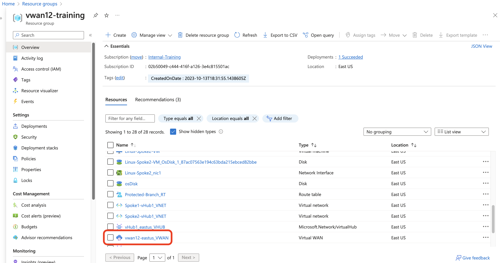
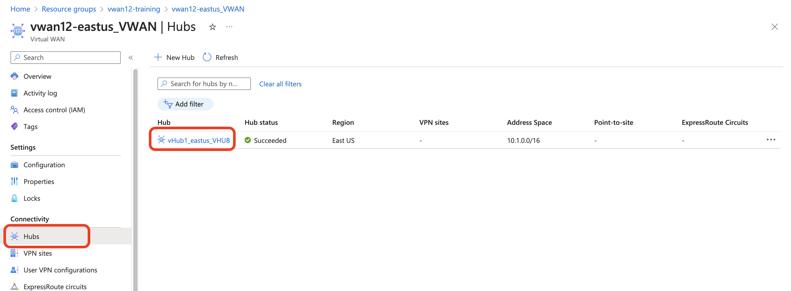
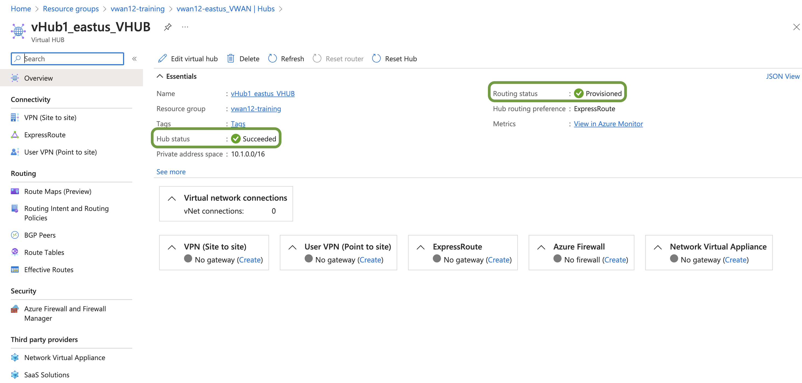
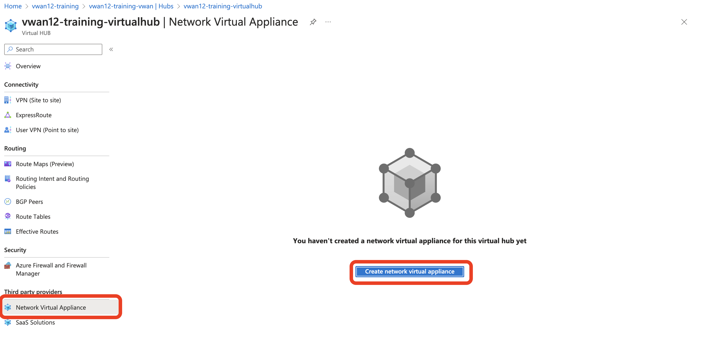
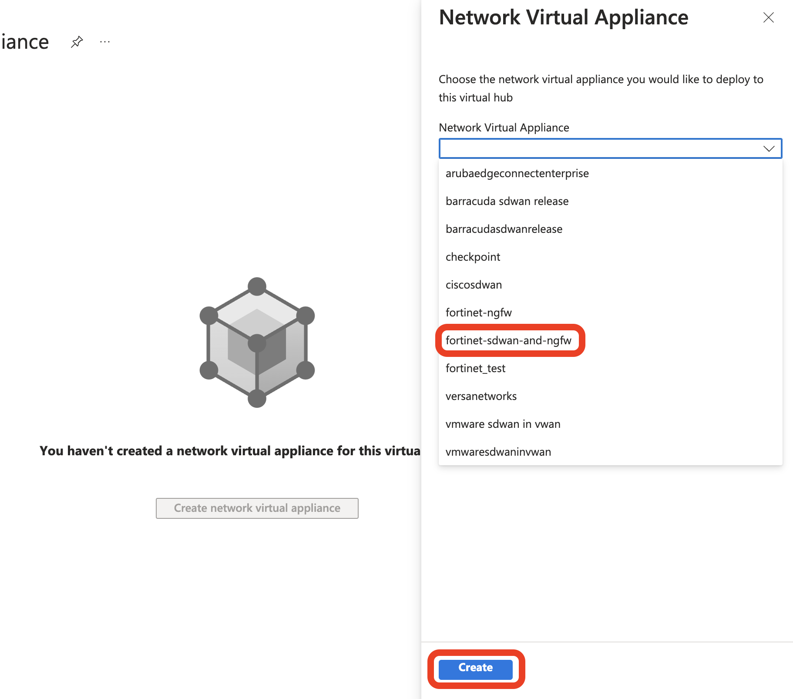
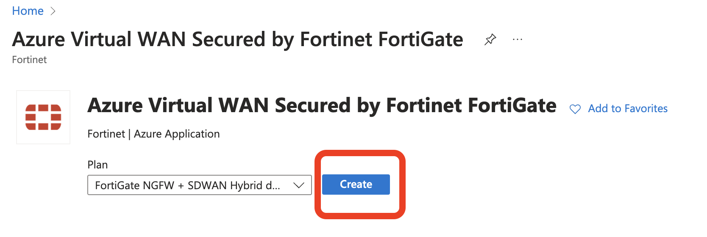
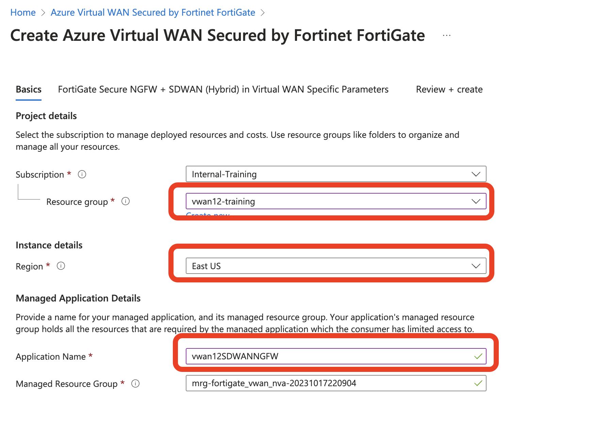
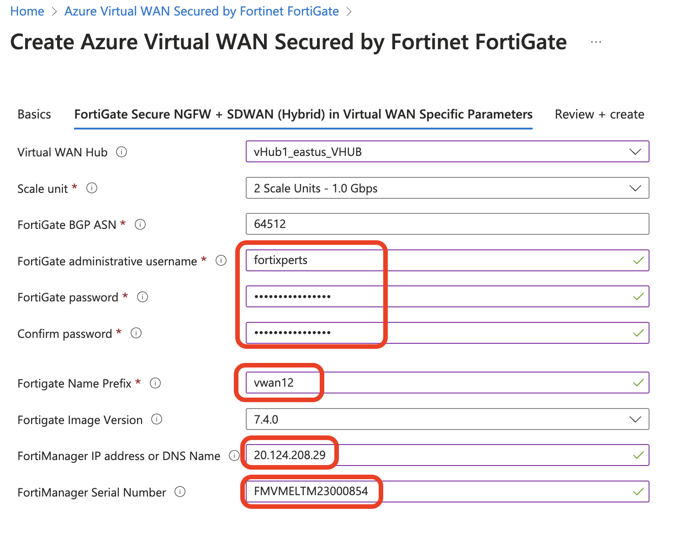
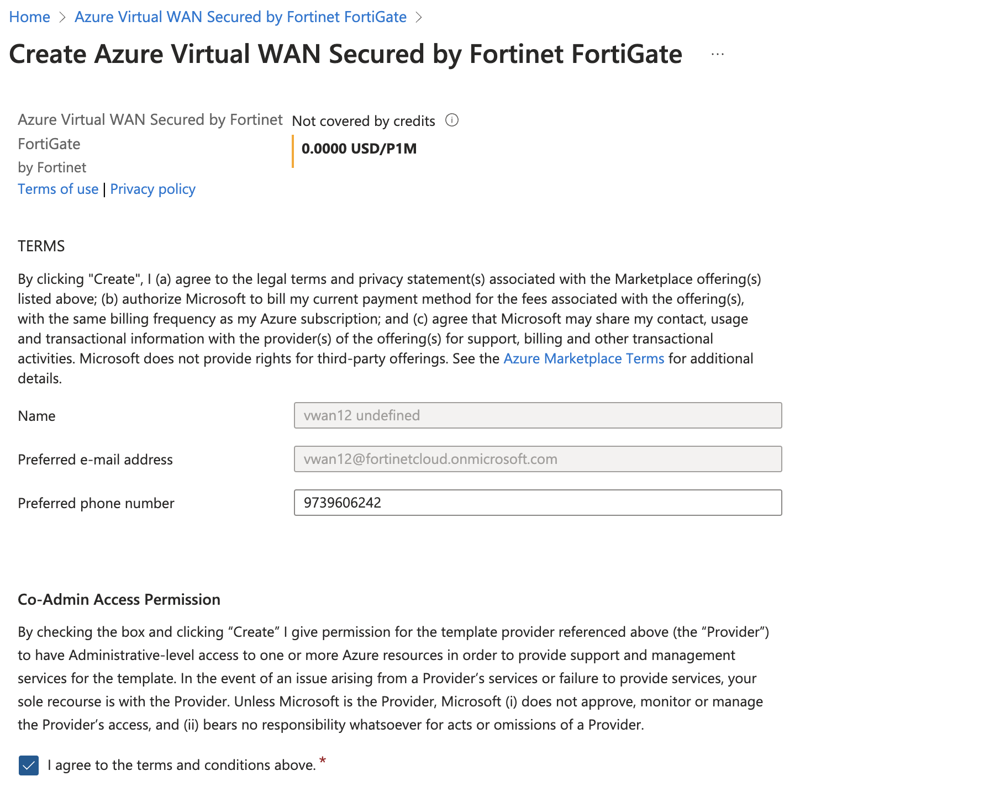

1. Click on VWAN in the resources that are already deployed. 



2. Navigate to click on Hubs on the left hand secrtion. A hub in East US is already deployed. The HUB deployment usually takes about 30-40 minutes and in the view of time allocated this has been done already.



3. Click on the Hub and check information about Hub name, region, IP address allocated to hub. 


4. Check to make sure Hub routing status: provisioned and Hub status: Succeeded before you continue to other steps.  Note: please move on to the next step only if provisioned with green checks. 



5. Click on the NVA option under third party providers > Create Network appliance.



6. Select fortinet-sdwan-and-ngfw , Create. proceed to leave site to redirect to Marketplace. 



7. On the marketplace you should see a page like below. click create. 



8. In the NVA creation step1: Set the Resource group to **vwanXX-training** (Reminder: XX is the lab allocated to you), Make sure the region is set to **East US** , Application name: vwan**XX**SDWANNGFW (**XX is the lab number**), Click next



9. In the NVA creation step2: Slect the VWAN hub in your Resource group - **vHub1_eastus_VHUB**, Fortigate admin username to ```fortixperts``` password to ```Fortixperts2024!```, Fortigate prefix to **vwan_XX_**, Version to **7.4.0** and Fortimanger IP ```20.124.208.29``` Serial number ```FMVMELTM23000854```



10. In the final step, make sure to scroll down to agree to the terms and conditions. Click Create. 



11. this will take 15 minutes to get deployed. So we can now use this time to grab a Coffee ;) and relax! 