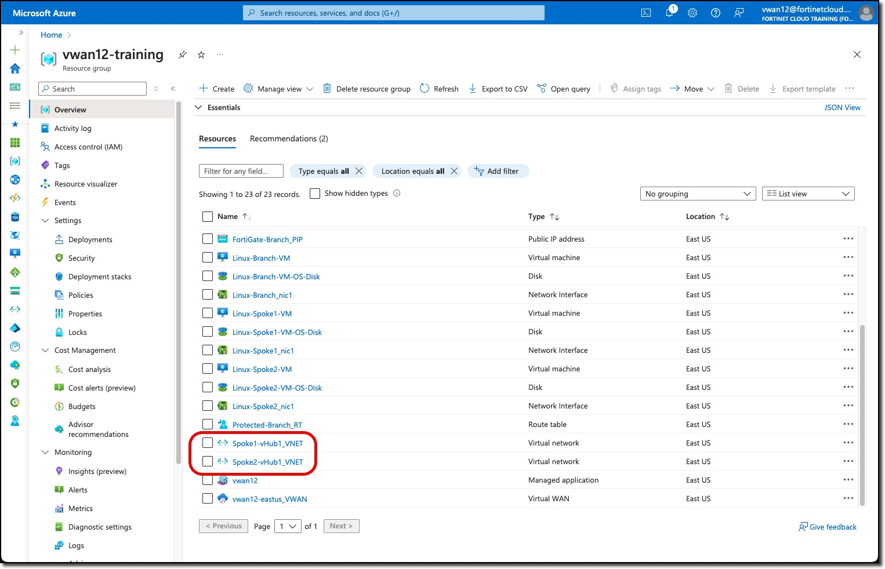
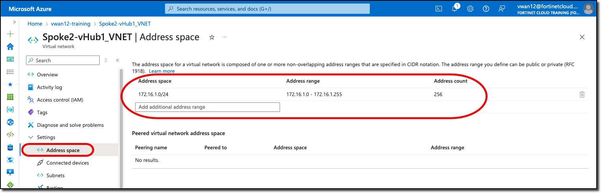
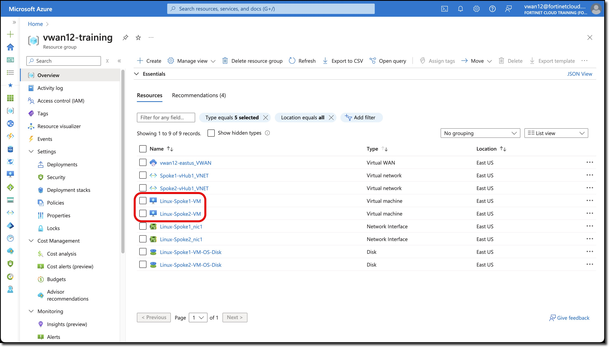
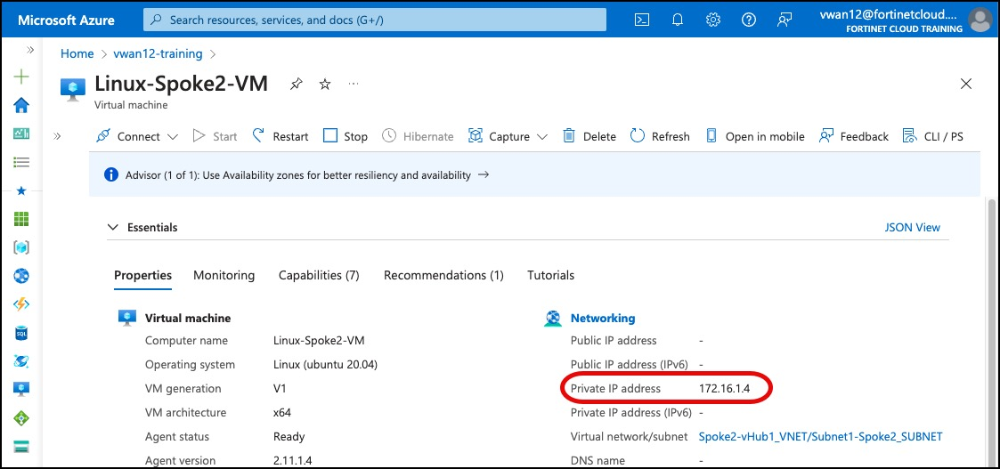
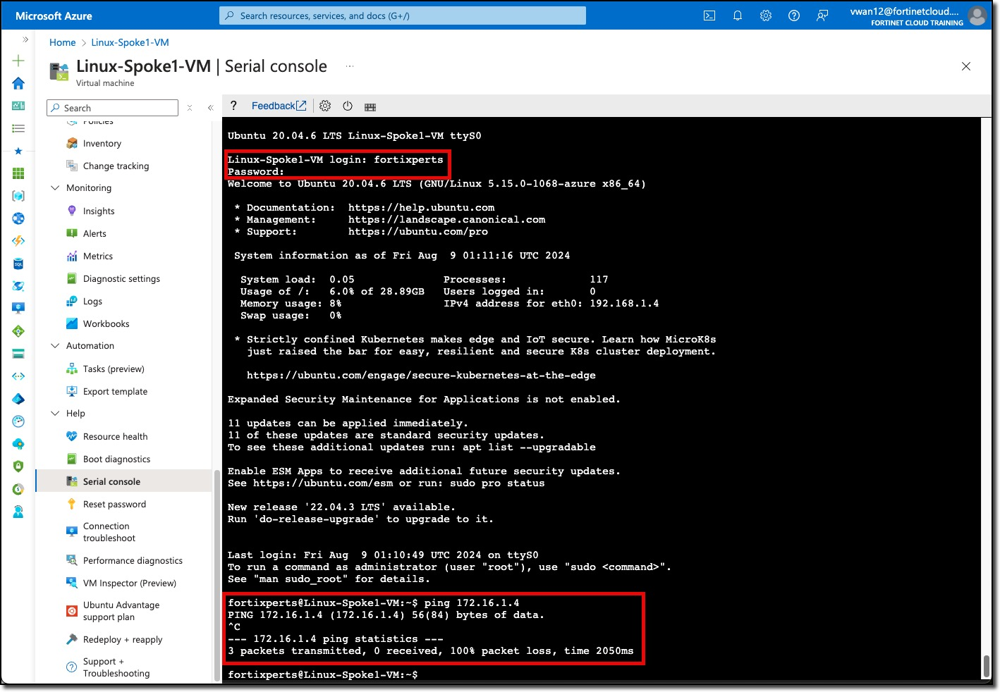

## Task 4

### Spoke Virtual Networks (VNETs) and Virtual Machines (VMs)

1. ***View*** the Spoke VNETs Address Space

    - Spoke1-vHub1_VNET with address space 192.168.1.0/24
    - Spoke2-vHub1_VNET with address space 172.16.1.0/24

    

    VNET assigned address space can be view by:
    - ***Clicking*** on a VNET
    - ***Clicking*** "Address space" in the left-hand navigation

    VNET **Spoke2-vHub1_VNET** is shown below.

    

1. ***View*** the private IP addresses of the Spoke VNETs Linux VMs

    - Linux-Spoke1_VM IP `192.168.1.4`
    - Linux-Spoke2_VM IP `172.16.1.4`

    

    Linux-Spoke1_VM        | Linux-Spoke2_VM
    :-------------------------:|:-------------------------:
     |  

1. ***Access*** the Serial console on Linux-Spoke1_VM view

    - ***Scroll*** to the bottom of the left-hand navigation on the Linux-Spoke1_VM resource page
    - ***Expand*** the "Help" section (if not already expanded)
    - ***Click*** "Serial console"

    A serial console session will start in the right-hand pane

1. ***Login*** to Linux-Spoke1_VM

    - username `fortixperts`
    - password `Fortixperts2024!`

1. ***Ping*** Linux-Spoke2_VM

    - `ping 172.16.1.4`

    

1. ***Ping*** Linux-Spoke1_VM from Linux-Spoke2_VM

    - ***Repeat*** previous steps to access the serial console of ***Linux-Spoke2_VM***

1. ***Ping*** an Internet resource

    - `ping 8.8.8.8`

    Both ping tests will fail, these resources are unable to access each other and resources on the Internet.
