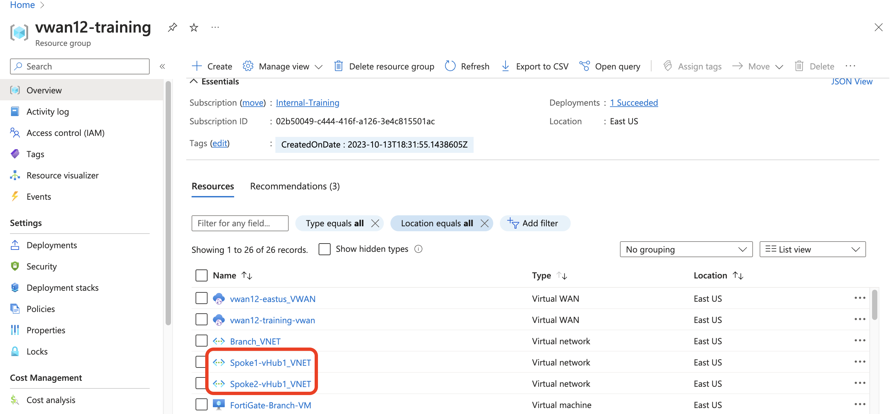
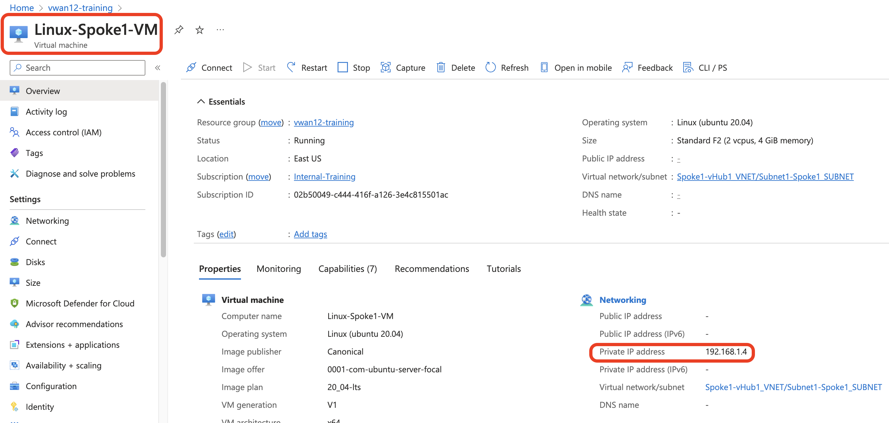
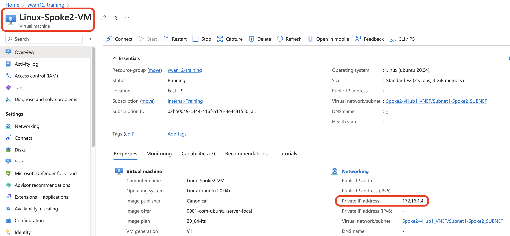
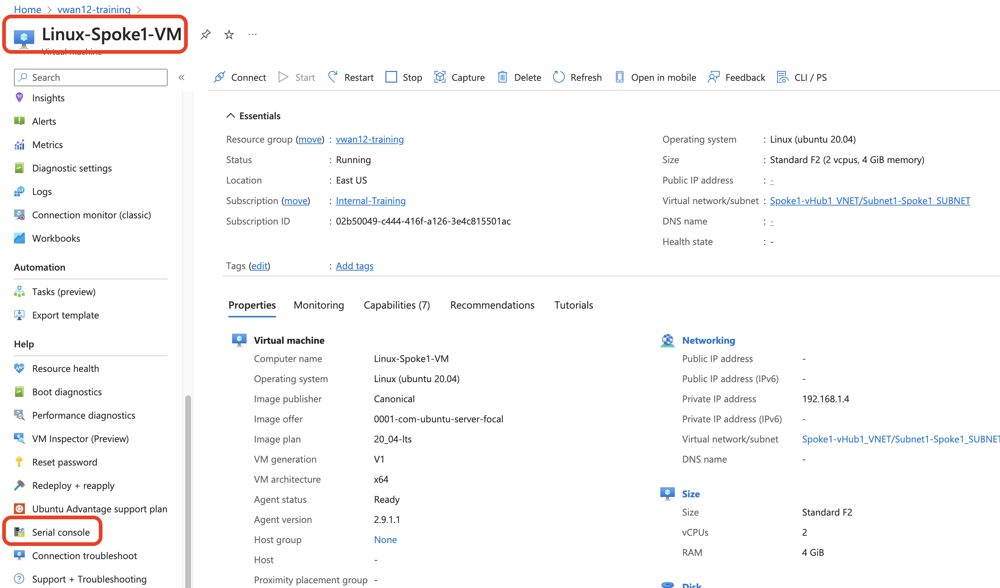
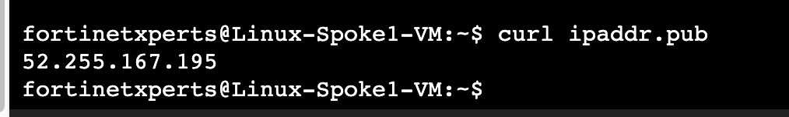

## Check to make sure there is no traffic between VNETS


1. Spoke1-vHub1_VNET with address space 192.168.1.0/24 and Spoke2-vHub1_VNET with address space 172.16.1.0/24 have already been deployed.



2. In the resources, note Linux-Spoke1_VM IP(192.168.1.4) and Linux-Spoke2_VM IP (172.16.1.4)

Linux-Spoke1_VM        | Linux-Spoke2_VM
:-------------------------:|:-------------------------:
 |  

 

3. On the Linux-Spoke1_VM view, scroll down to click on Serial console. 



4. Click on Serial Console to login to the Linux VM with username ```fortixperts``` and password ```Fortixperts4!```

5. “Once logged in”, ```ping 172.16.1.4```. Do you get a response? Why not? 


6. Also confirm access to the internet ```ping 8.8.8.8``` and to get your Public ip address ```curl ipaddr.pub```.    Note: your IP address might be different from below. 

