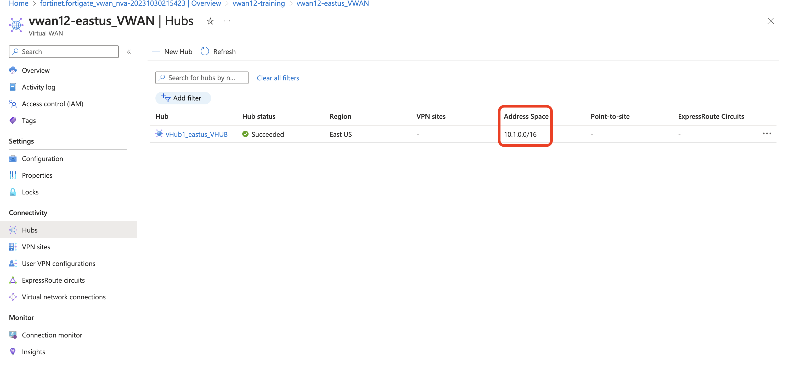
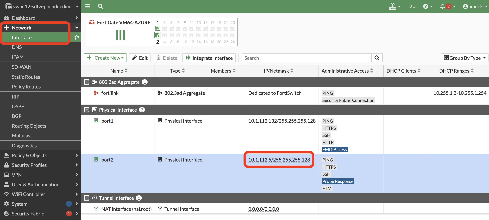
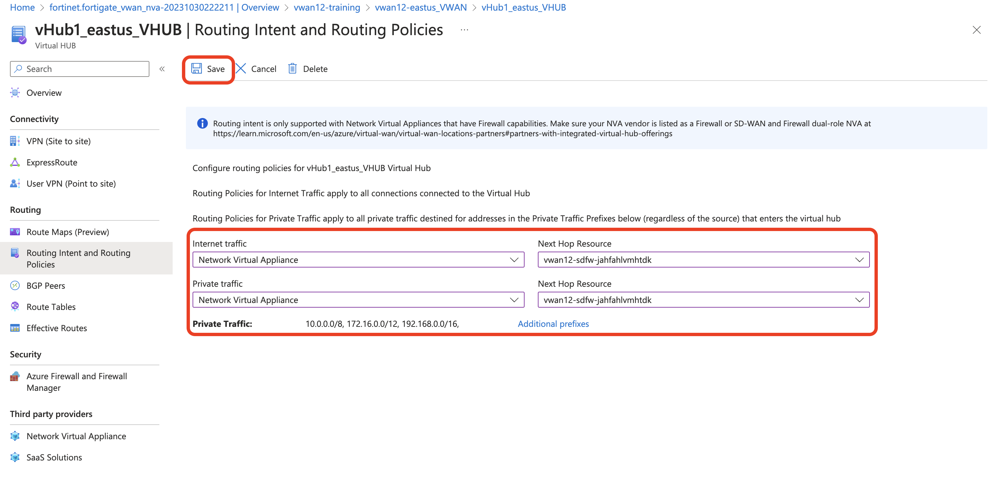

#### BGP  


1. Confirming the private address space of the vWAN hub
The private address space of the vWAN hub is needed to create a summary route from the private address range to the secondary interfaces of the FortiGate NVAs, unless there is a more specific, connected route to establish BGP peering. The BGP peers are already configured and ready to go online after the route is enabled.


2. To confirm the private address space of the vWAN hub:
    - On Azure portal, select the virtual WAN hub.
    - On the Overview pane, note the Private address space.

    


3. Retrieving subnet information from FortiGate NVAs
We will connect to the CLI for one of the managed FortiGate NVAs and look at port2 to locate and note the first IP address of the subnet on the FortiGate. The first IP address will be the local gateway for communicating with the virtual WAN hub routers.

    To retrieve the subnet information from FortiGate NVAs:
    connect to the CLI for one of the FortiGates by using SSH or by logging to Web UI and locating the IP address under Network >> interfaces. 

    In the CLI console, run the ```get system interface command```, and look at the results for port2.

    In the following example, the first IP of the subnet is 10.1.112.1.

    (In this example, the administrator's IP address is 10.1.112.5, and they have a /25 mask, which makes the network address 10.1.112.0, and the first IP, which Azure assigns to the virtual switch, is 10.1.112.1)

 


4. Configuring the static route on each FortiGate NVA
On each FortiGate VM, configure static routing to the virtual hub routers through the virtual switch. While creating static routes, we also need a route to respond to the Azure load balancer probes, which come in from IP address 168.63.129.16.

5. To configure the static route on each FortiGate NVA:
From FortiManager, connect to the CLI for one of the FortiGates by using SSH.
Run the following commands on a FortiGate NVA in the device group:
config router static
    edit 0 
        set dst 10.1.0.0/16
        set gateway 10.1.112.1
        set device port2
    next
    edit 0
        set dst 168.63.129.16/32
        set distance 5
        set gateway 10.1.112.1
        set device port2
end

6. Repeat the commands on each FortiGate NVA in the device group.
Verifying BGP communication between FortiGate NVAs
After configuring the static route on all FortiGate NVAs, BGP peering is automatically enabled, and you can verify BGP communication.

To verify BGP communication between FortiGate NVAs:
On the FortiGate NVA, run the ```get router info bgp summary``` command.


If configured correctly, the address space from the Peering a vNET to the virtual WAN hub section should be propagated as well.

Please follow [fortinetdocs ](https://docs.fortinet.com/document/fortigate-public-cloud/7.4.0/azure-vwan-ngfw-deployment-guide/860717/configuring-static-routes-and-enabling-bgp-on-fortigate-nvas "Fortinet documents") for more information. 

#### Routing Intent

1. Enable routing intent on the Hub once the bgp is up. 

2. Routing Intent and Routing Policies allow you to configure the Virtual WAN hub to forward Internet-bound and Private (Point-to-site VPN, Site-to-site VPN, ExpressRoute, Virtual Network and Network Virtual Appliance) Traffic to an Azure Firewall, Next-Generation Firewall Network Virtual Appliance (NGFW-NVA) or security software-as-a-service (SaaS) solution deployed in the virtual hub.

3. To enable routing intent on Azure VWAN hub , VWAN >> VWAN Hub >> click on Hub >> Routing intent and Routing policies and set the internet traffic, private traffic to the NVA group deployed as shown below. 



{} Make sure to click save if not routing policy will not be updated.{}

