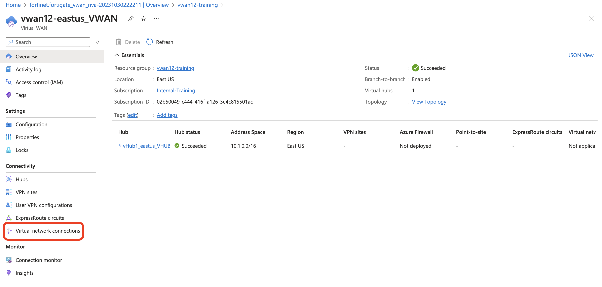
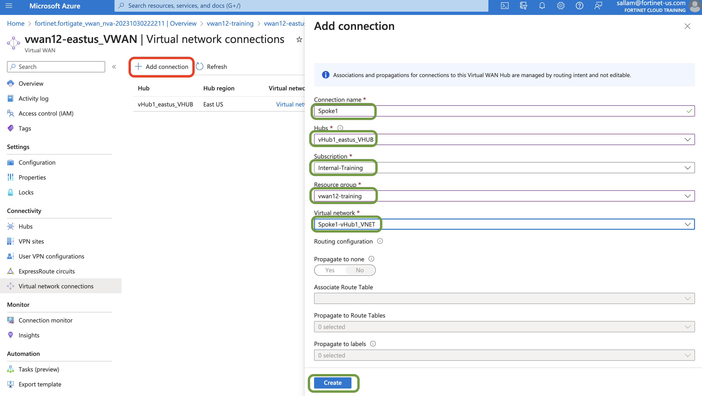
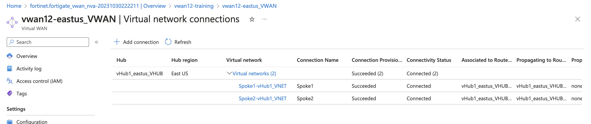
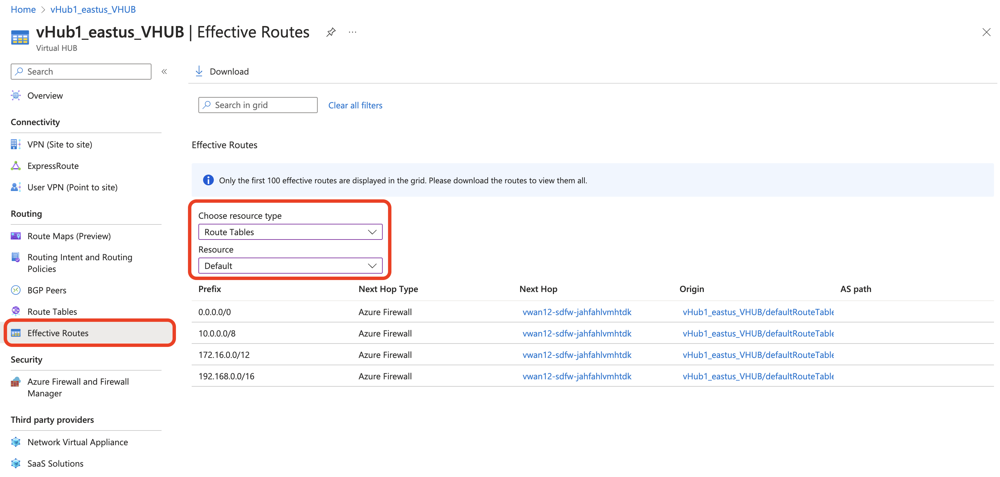
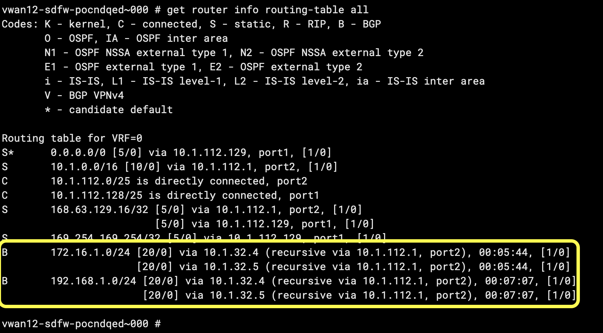
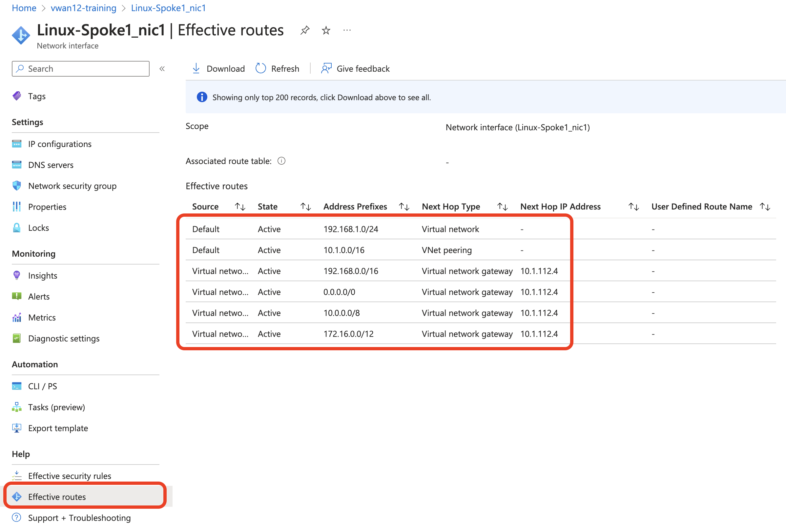

### Spoke VNET peering to Hub 


1. Before verifying bgp routing table on Azure Virtual Hub and Fortigate we need peer the spoke VNETS to Virtual Hub. 

2. To peer the Spoke VNETS to hub,  Click on Virtual WAN >> Virtual Network Connections



3. Click Add connection at the top and fill in the details for both Spoke1 and Spoke2 as shown below. 



4. Once the peering is complete, the VCN table should like below.



### Time to verify your work

1. Check the Hub default route table. To check the effective routes, VWAN >> East US - hub >> Effective Routes. 

The default route and RFC1918 routes will have NVA group as next hop. 



2. on the Fortigate, we can see that Hub will be BGP advertising VNET's to Fortigate. You can use ```get router info routing-table all```



3. Check the effective routes on Spoke Virtual machines by clicking Effective routes on Linux VM's NIC.



The effective routes next Hop IP is the IP address of Internal Load balancer that gets deployed along with managed application. 

