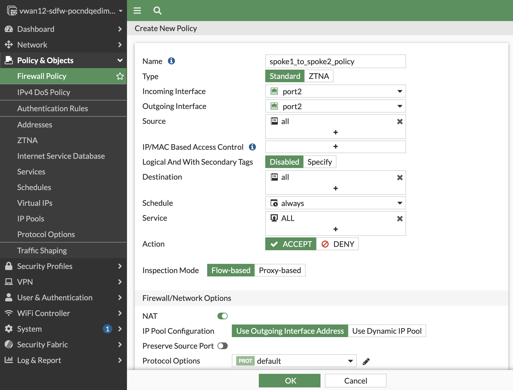
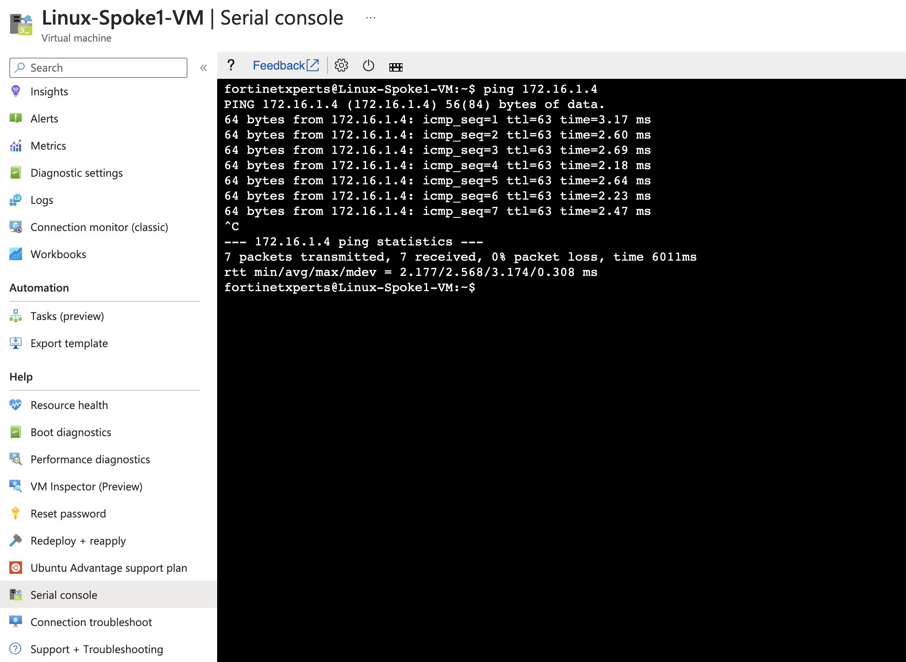

### Spoke to Spoke traffic

1. ping between Linux VM's. Can you see the ping response? if not, what is missing? you even have route to spoke VM's, and routing intent enabled?

2. You might have guessed it right. If not, its alright we are here to learn :) 

Its the firewall policy on the FortiGate's. Since FortiGate can do microsegmentation it does not allow traffic on Port2 to Port2 by default and segments the traffic incoming and outgoing on same port2. We still need a microsegmentation policy to allow traffic between Spoke VM's. 

3. Create Firewall policy as shown below on both the FortiGate's. 

4. Now try SSH or Ping between Linux VM's. 

