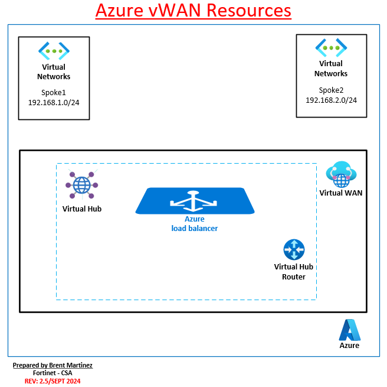

### Azure vWAN Resources
To configure an end-to-end virtual WAN, you create the following resources:

- **Virtual WAN:** The virtual WAN resource represents a virtual overlay of your Azure network and is a collection of multiple resources. It contains links to all your virtual hubs that you would like to have within the virtual WAN. Virtual WANs are isolated from each other and can't contain a common hub. Virtual hubs in different virtual WANs don't communicate with each other.

- **Hub:** A virtual hub is a Microsoft-managed virtual network. The hub contains various service endpoints to enable connectivity. From your on-premises network (vpnsite), you can connect to a VPN gateway inside the virtual hub, connect ExpressRoute circuits to a virtual hub, or even connect mobile users to a point-to-site gateway in the virtual hub. The hub is the core of your network in a region. Multiple virtual hubs can be created in the same region.

A hub gateway isn't the same as a virtual network gateway that you use for ExpressRoute and VPN Gateway. For example, when using Virtual WAN, you don't create a site-to-site connection from your on-premises site directly to your VNet. Instead, you create a site-to-site connection to the hub. The traffic always goes through the hub gateway. This means that your VNets don't need their own virtual network gateway. Virtual WAN lets your VNets take advantage of scaling easily through the virtual hub and the virtual hub gateway.

- **Hub virtual network connection:** The hub virtual network connection resource is used to connect the hub seamlessly to your virtual network. One virtual network can be connected to only one virtual hub.

- **Hub-to-hub connection:** Hubs are all connected to each other in a virtual WAN. This implies that a branch, user, or VNet connected to a local hub can communicate with another branch or VNet using the full mesh architecture of the connected hubs. You can also connect VNets within a hub transiting through the virtual hub, as well as VNets across hub, using the hub-to-hub connected framework.

- **Hub route table:** You can create a virtual hub route and apply the route to the virtual hub route table. You can apply multiple routes to the virtual hub route table.

In this workshop the student will use these resources to help create network traffic and route to the FortiGate NVAs. 

**Continue to Chapter 2 - Task 3: FortiGate NVA Support for vWAN**