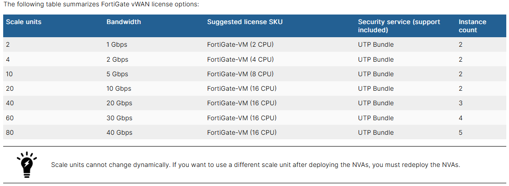
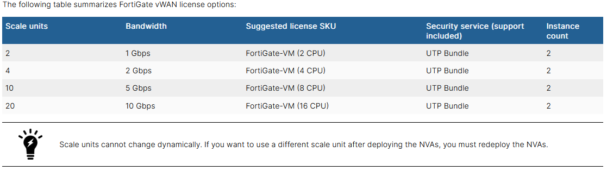

Microsoft Azure supports virtual WAN (vWAN), and partners with third-party solution providers, such as Fortinet, to deploy network virtual appliances (NVAs) to a vWAN hub.

### FortiGate NVA
By combining stateful inspection with a comprehensive suite of powerful security features, FortiGate next generation firewall technology delivers complete content and network protection. This solution is available for deployment in the Microsoft Azure vWAN managed service.

In addition to advanced features such as an extreme threat database, vulnerability management, and flow-based inspection, features including application control, firewall, antivirus, IPS, web filter, and VPN work in concert to identify and mitigate the latest complex security threats.

FortiGate NVAs are deployed in an active/active high availability (HA) configuration with FortiGate-native FGSP synchronization between the NVAs.

### Order Types
You can choose one of the following scale unit values when deploying FortiGate NVAs.  Higher scale units are available for increased bandwidth requirements. A specific FortiGate virtual machine license is recommended for each scale unit value.

- NGFW Deployment

- SD-WAN NGFW Deployment

### Deployment Requirements
Deployment requires the following:
- Two full FortiGate licenses if using bring your own license (BYOL) or FortiFlex. Alternatively, you can select pay as you go (PAYG) during deployment.
- One fully licensed FortiManager instance (PAYG or BYOL)

**Continue to Chapter 3 - Getting Started**