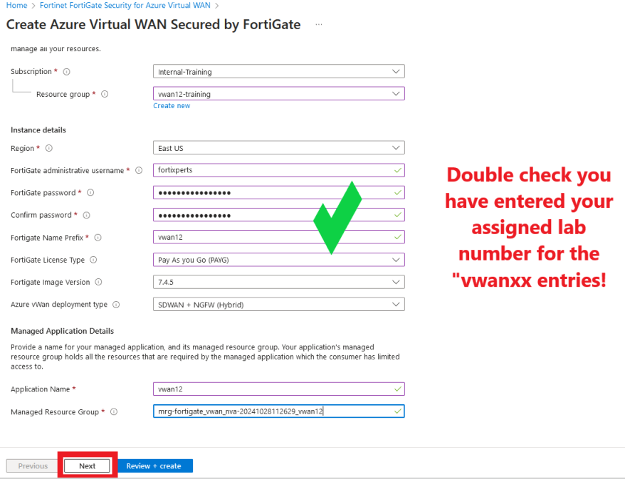
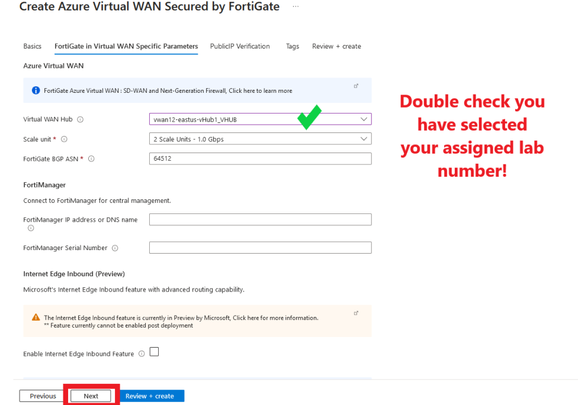
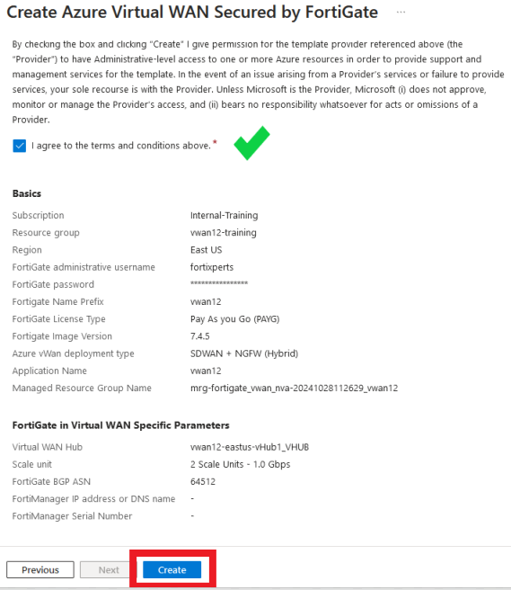
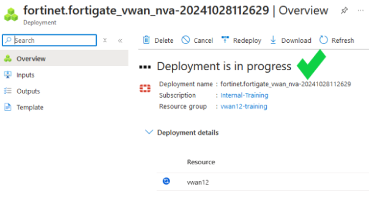
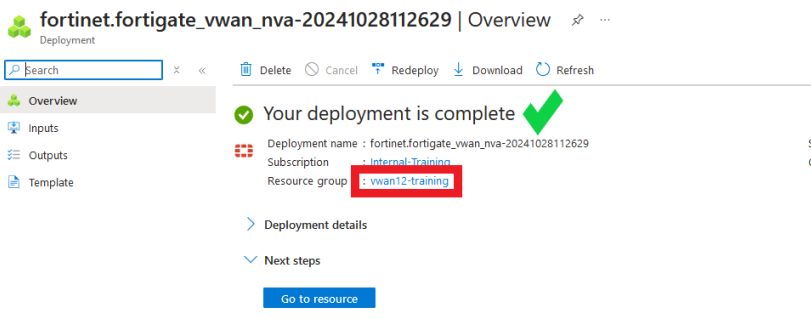

In task one, you will deploy a FortiGate NVA into the vWAN hub that you have been assigned to.

1. ***Click*** on VWAN **vwanXX-training_VWAN** in your Resource Group. **XX** is the number of your allocated environment.

    

2. ***Click*** on "Hubs" in the "Connectivity" section of the left-hand navigation. A hub in EastUS has already been deployed.

    

3. ***Click*** on your assigned hub

4. ***View*** information about Hub

    - Name
    - Location (Region)
    - Private Address Space

5. ***Confirm*** the status of the following:

    - Hub status: **Succeeded**
    - Routing status: **Provisioned**

        

        {}Note: please move on to the next step **only** if Hub and Routing status have green checks.{}

6. ***Click*** on "Network Virtual Appliance in the "Third party providers" section of the left-hand navigation.
7. ***Click*** the button "Create network virtual appliance"
8. ***Select*** fortinet-sdwan-and-ngfw
9. ***Click*** "Create". proceed to leave site to redirect to Marketplace.


- If a warning is displayed about "Leaving" the site, select the **Leave page** button.
        

10. ***Click*** "Create" on the Marketplace listing for "**Azure Virtual WAN Secured by FortiGate**"

    

11. ***Click*** on "Yes, continue" on the Continue creating this plan? screen.


12. On the "Create Azure Virtual WAN Secured by FortiGate" window, enter the following values in the **Basics** tab:

    - ***Select*** - Resource Group - **vwanXX-training** -- *Be sure to select your assigned Resource Group*
    - ***Select*** - Region - **East US** -- *May already be defaulted to the correct region*
    - ***Enter*** - FortiGate administrative username - ```fortixperts```
    - ***Enter*** - password - ```Fortixperts2024!```
    - ***Confirm*** - password - ```Fortixperts2024!```
    - ***Enter*** - FortiGate Name Prefix - **vwanXX** -- *Enter your assigned lab number for XX.*
    - ***Select*** - FortiGate License Type - "**Pay As you Go (PAYG)**"
    - ***Select*** - FortiGate Image Version - "**7.4.X**" -- *Be sure to select the highest 7.4 version.*
    - ***Select*** - Azure vWan deployment type - "**SDWAN + NGFW (Hybrid)**"
    - ***Enter*** - Application Name - **vwanXX** -- *Enter your assigned lab number for XX.*
    - ***Update*** - Managed Resource Group - Append "**_vwanXX**" to the provided name -- *Enter your assigned lab number for XX.*
    - ***Click*** - "**Next**"



13. On the **FortiGate in Virtual WAN Specific Parameters** tab, enter the following values:

    - ***Select*** Virtual WAN Hub - select vwanXX-eastus-vHub1_VHUB -- **Be sure to enter your assigned lab number for XX.**
    - ***Leave*** all other items as is
    - ***Click*** "Next"



14. On the **PublicIP Verification** tab, select "Next".

    - ***No screenshot included in the step***

15. On the **Tags** tab, select "Next".

    - ***No screenshot included in this step***

16. On the **Review + create** tab, select the following:

    - ***Scroll*** down to agree to the terms and conditions
    - ***Click*** "Create"




{}The FortiGate NVAs take about 15 minutes to deploy. Grab a refreshment and relax! You will see the screen belows when the deployment is in progress and when complete.{}





17. Click on your assigned **Resource group** to return to your RG and prepare for the next task.




Continue to ***Chapter 4 - Task 2: Configure FGSP***
