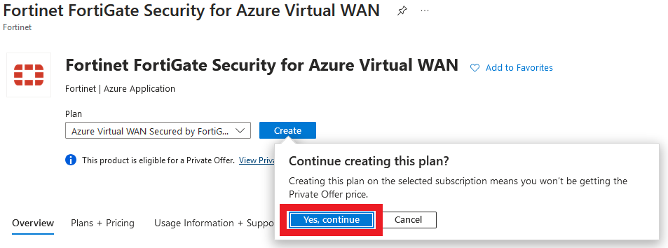

In task one, you will deploy a FortiGate NVA into the vWAN hub that you have been assigned to.

1. ***Click*** on VWAN **vwanXX-training_VWAN** in your Resource Group. **XX** is the number of your allocated environment.

    

1. ***Click*** on "Hubs" in the "Connectivity" section of the left-hand navigation. A hub in EastUS has already been deployed.

    

1. ***Click*** on your assigned hub

1. ***View*** information about Hub

    - Name
    - Location (Region)
    - Private Address Space

1. ***Confirm*** the status of the following:

    - Hub status: **Succeeded**
    - Routing status: **Provisioned**

        

        {}Note: please move on to the next step **only** if Hub and Routing status have green checks.{}

1. ***Click*** on "Network Virtual Appliance in the "Third party providers" section of the left-hand navigation.
1. ***Click*** the button "Create network virtual appliance"
1. ***Select*** fortinet-sdwan-and-ngfw
1. ***Click*** "Create". proceed to leave site to redirect to Marketplace.


- If a warning is displayed about "Leaving" the site, select the **Leave page** button.
        

1. ***Click*** "Create" on the Marketplace listing for "**Azure Virtual WAN Secured by FortiGate**"

    

10. ***Click*** on "Yes, continue" on the Continue creating this plan? screen.



1. On the "Create Azure Virtual WAN Secured by FortiGate" window, enter the following values in the **Basics** tab:

    - ***Select*** - Resource Group - **vwanXX-training** -- *Be sure to select your assigned Resource Group*
    - ***Select*** - Region - **East US** -- *May already be defaulted to the correct region*
    - ***Enter*** - FortiGate administrative username - ```fortixperts```
    - ***Enter*** - password - ```Fortixperts2024!```
    - ***Confirm*** - password - ```Fortixperts2024!```
    - ***Enter*** - FortiGate Name Prefix - **vwanXX** -- *Enter your assigned lab number for XX.*
    - ***Select*** - FortiGate License Type - "**Pay As you Go (PAYG)**"
    - ***Select*** - FortiGate Image Version - "**7.4.X**" -- *Be sure to select the highest 7.4 version.*
    - ***Select*** - Azure vWan deployment type - "**SDWAN + NGFW (Hybrid)**"
    - ***Enter*** - Application Name - **vwanXX** -- *Enter your assigned lab number for XX.*
    - ***Update*** - Managed Resource Group - Append "**_vwanXX**" to the provided name -- *Enter your assigned lab number for XX.*
    - ***Click*** - "**Next**"

    

1. **FortiGate in Virtual WAN Specific Parameters Tab values**

    - ***Select*** Virtual WAN Hub - select vwanXX-vHub1_eastus -- **Be sure to enter your allocated environment number for XX.**
    - ***Leave*** all other items as is
    - ***Click*** "Next"

        

1. **PublicIP Verification Tab values**

    - ***Click*** "Next"

        

1. **Tags Tab values**

    - ***Click*** "Next"

        

1. **Review + create Tab values**

    - ***Scroll*** down to agree to the terms and conditions
    - ***Click*** "Create"

        

        {}The FortiGate NVAs take about 15 minutes to deploy. Grab a refreshment and relax! You will see the screen belows when the deployment is progressing and complete.{}

        
        

Continue to ***Chapter 4 - Task 2: Configure FGSP***
