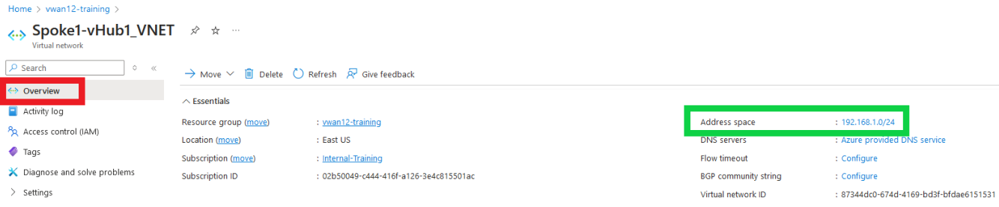
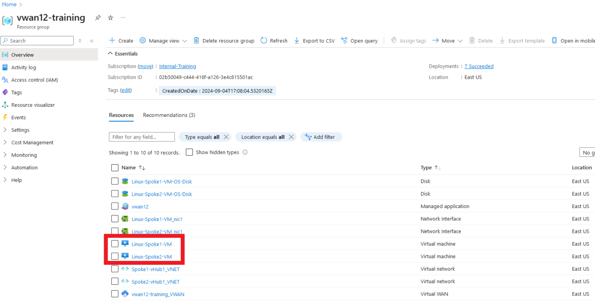
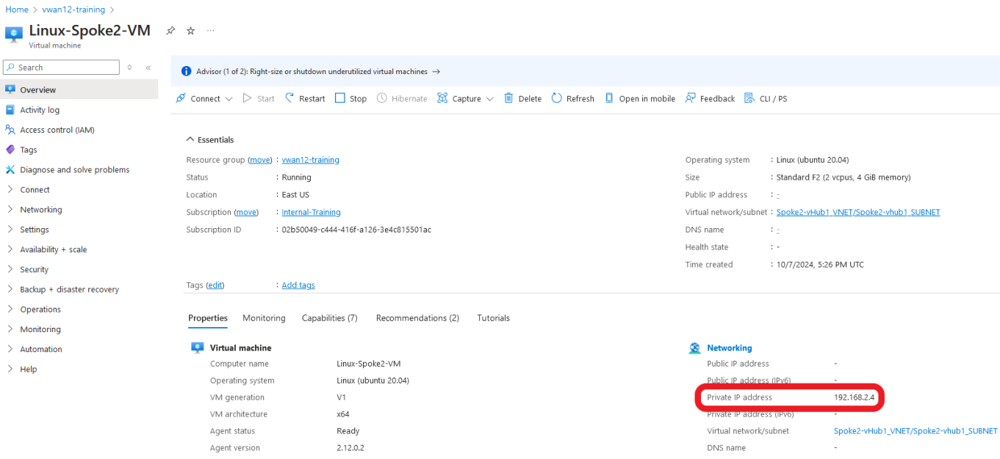
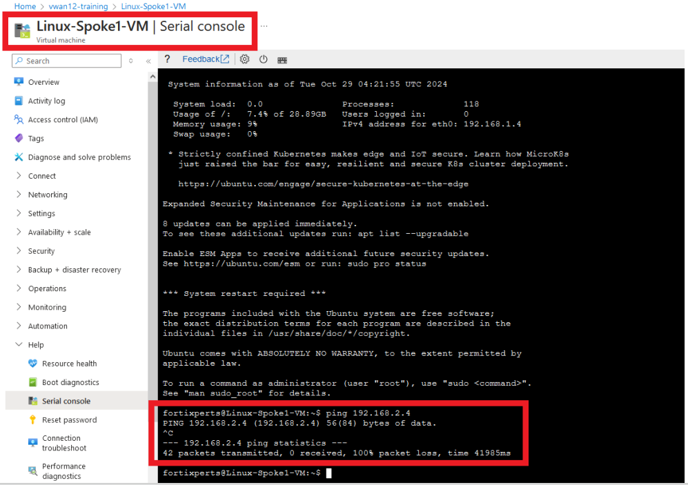

To be part of an Azure Virtual WAN, Azure VNETs need to be peered to the Azure vWAN hub. Prior to VNETs being connected to a vWAN, virtual machines in the VNET will route their traffic based on Azure default routing, user defined routing (UDR), or routes advertised by the Azure Route Server.

Two "Spoke" VNETs have been deployed in your assigned resource group, each with a Linux virtual machine (VM). The spoke VNETs are just stand-alone VNETs which means the Linux VMs in one spoke cannot communicate with Linux VMs in the other spoke without setting up VNET peering with the hub and configuring routing.

In this task, the student will setup peering between the VNETs/spokes and the vWAN hub.  Then confirm the Linux VMs cannot communicate between VNETs and the Internet.

1. To view the assigned VNET address space, navigate from your assigned resource group to the two VNETs - **"Spoke1-vHub1_VNET"** and **"Spoke2-vHub1_VNET"**.

2. VNET assigned address space can be viewed by:
    - ***Clicking*** on a VNET
    - Note the address space on the right side of the "Overview" pane.

        VNET **Spoke1-vHub1_VNET** is shown below.
        

2. To view the private IP addresses of the spoke VNET Linux VMs, navigate from your assigned resource group to each Linux VM - **"Linux-Spoke1_VM"** and **"Linux-Spoke2_VM"**.

    

        Linux-Spoke1_VM        | Linux-Spoke2_VM
        :-------------------------:|:-------------------------:
         |  

1. Access the serial console on the Linux-Spoke1_VM.

    - ***Scroll*** to the bottom of the left-hand navigation on the Linux-Spoke1_VM resource page
    - ***Expand*** the "Help" section (if not already expanded)
    - ***Click*** "Serial console"

    A serial console session will start in the right-hand pane

1. Login to Linux-Spoke1_VM:

    - username `fortixperts`
    - password `Fortixperts2024!`

1. Ping Linux-Spoke2_VM:

    - `ping 192.168.2.4`

        

1. Ping Linux-Spoke1_VM from Linux-Spoke2_VM:

    - Repeat previous steps to access the serial console of ***Linux-Spoke2_VM***

1. Ping an Internet resource from both Linux VMs:

    - `ping 8.8.8.8`

    **Both ping tests will fail, these resources are unable to access each other and resources on the Internet.**

Continue to ***Chapter 4 - Task 4: BGP & Routing Intent***
