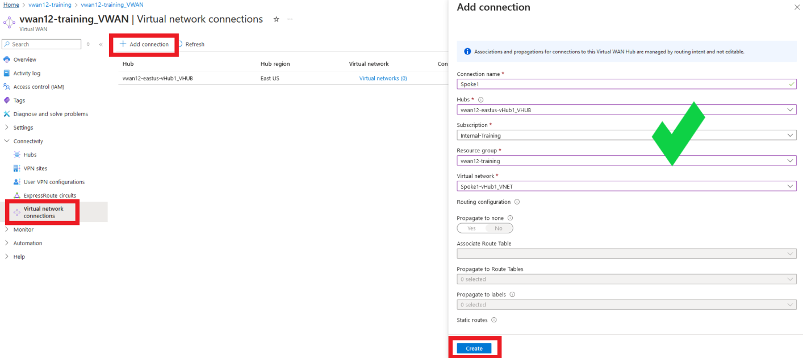
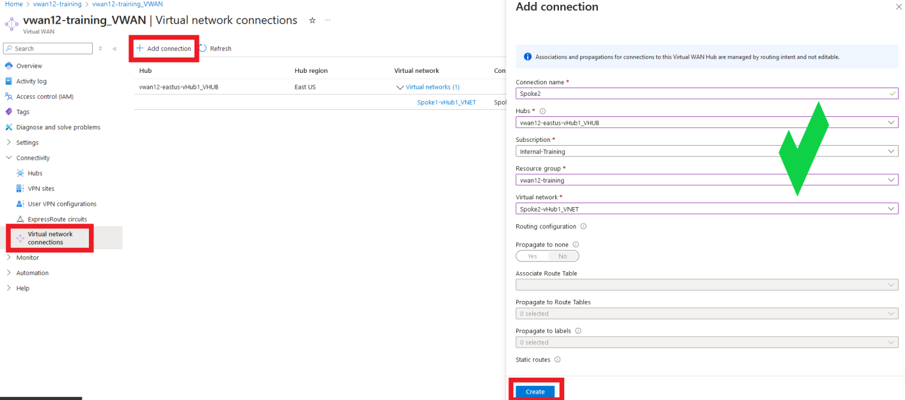
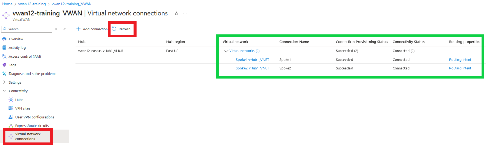
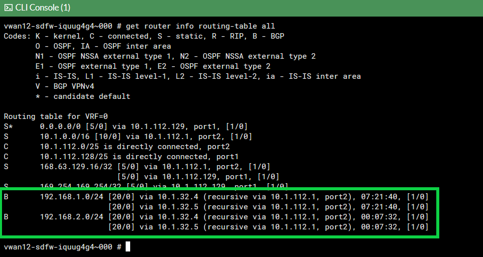
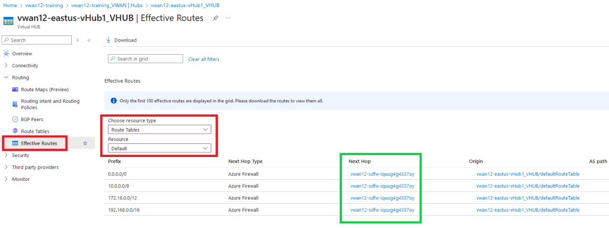
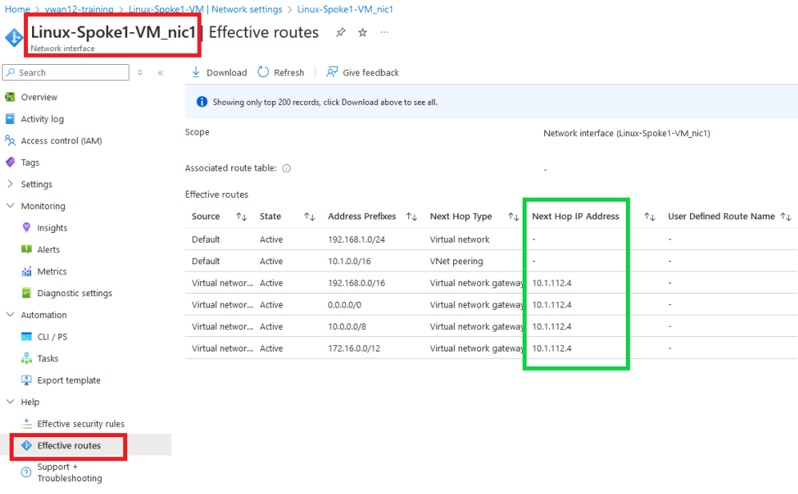

In this task, the student will setup peering between the spokes/VNETs and the vWAN hub.
Then second part of this task it to verify routing by viewing the routing tables on the FortiGate NVAs, the hub, and effective routes on the Linux hosts.

### Peer Spoke VNETS to Hub

1. ***Peer*** Spoke1 VNET to hub

    - ***Navigate*** to your Virtual Wan - **vwanXX-training_VWAN**
    - ***Click*** "Virtual network connections" on the left under "Connectivity".
    - ***Click*** "+ Add connection"

    - ***Enter*** - "Connection name" - `Spoke1`
    - ***Select*** - "Hubs" - your Hub -**vwanXX-eastus-vHub1_VHUB**
    - ***Select*** - "Resource group" - your Resource - **vwanXX-training**
    - ***Select*** - "Virtual Network" - Spoke 1's VNET - **Spoke1-vHub1_VNET**
    - ***Click*** - "Create"

    

1. ***Peer*** Spoke2 VNET to hub

    - ***Navigate*** to your Virtual Wan - **vwanXX-training_VWAN**
    - ***Click*** "Virtual network connections" on the left under "Connectivity".
    - ***Click*** "+ Add connection"

    - ***Enter*** - "Connection name" - `Spoke2`
    - ***Select*** - "Hubs" - your Hub -**vwanXX-eastus-vHub1_VHUB**
    - ***Select*** - "Resource group" - your Resource - **vwanXX-training**
    - ***Select*** - "Virtual Network" - Spoke 2's VNET - **Spoke2-vHub1_VNET**
    - ***Click*** - "Create"

    

        {}VNET Peering takes a few minutes to complete. The Connectivity Status can be reviewed by ***Clicking*** Refresh{}

        

### Verify Routing

Routes and routing are the key for users to access workloads in an Azure VNET and for those workloads to be able to access resources outside of their VNET. At this point routes and routing should be set within the Azure environment and in the FortiGate NVAs.

From the perspective of the FortiGate, a decision will be made to send traffic to a specific port based on FortiGate policy. Once the traffic leaves the FortiGate's port, it is up to Azure to forward the traffic.

Where traffic will be sent in Azure can be determined by viewing the effective routes associated to a particular networking service.

- What routes do the FortiGates know about?
- What are the effective routes of the hub?
- What are the effective routes of the Linux VMs in the Spoke VNETs?

1. ***View*** each FortiGate's route table

    - ***Open*** each FortiGate in a browser tab/window
    - ***Open*** FortiGate CLI
    - ***Run*** CLI command `get router info routing-table all`

        

    The output shows that BGP routes have been learned for the two Spoke VNETs that were peered to the Hub

1. ***View*** the hub effective routes in the default route table

    - ***Navigate*** to your vWAN hub - **vwanXX-eastus-vHub1_VHUB**
    - ***Select*** - On the left side, expand "Routing" and then "Effective Routes"
    - ***Select*** - "Route Tables" under "Choose resource type"
    - ***Select*** - "Default" under "Resource"
  
        All effective routes should have the FortiGate NVA group as next hop.

        

1. View the effective routes on the spoke Linux VMs

    - ***Navigate*** to your Linux VM **Linux-Spoke1-VM**
    - ***Click*** - "Network settings" located under "Networking" on the left side of the page
    - ***Click*** - "Linux-Spoke1-VM_nic1 (primary) / ipconfig (primary)
    - One the next page, navigate to ***Help*** on the bottom left and ***Click*** - "Effective Routes"

    - Repeat for **Linux-Spoke2-VM**

        
        
        

    **The effective route's next hop IP is the IP address of internal load balancer that is deployed in the vWAN hub with the FortiGate NVAs.**

The diagram below is a visual representation of what you have deployed and configured.  Congrats!

]

Continue to ***Chapter 5 - Traffic Management***
