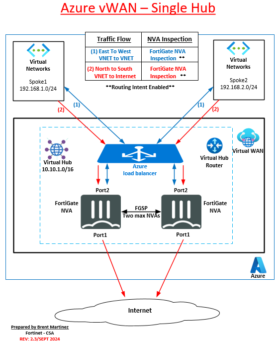

In this chapter, the student will navigate to your assigned vWAN hub and deploy a pair of Fortigate NVAs to secure the vWAN.  After the Fortigates have been deployed, the student will configure FGSP, dynamic routing, enable Routing Intent, and confirm connectivity between spoke/vNET resources.

### Overview
- Deploy FortiGate NVAs into asiigned VWAN hub
- Configure FGSP on both FortiGate NVAs
- Confirm VNET to VNET connectivity
- Configure BGP and enable Routing Intent
- Peer VNETs with the vWAN hub

After you have completed the above tasks, the diagram below is a visual representation of what you will have deployed and configured.

Continue to ***Chapter 4 - Task 1: - FortiGate NVA Deployment***
