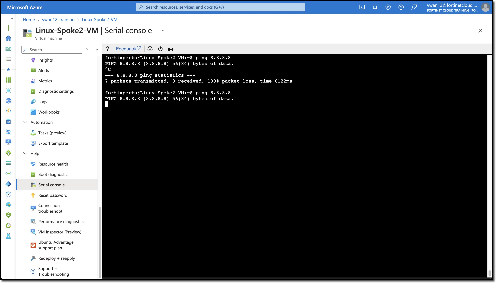
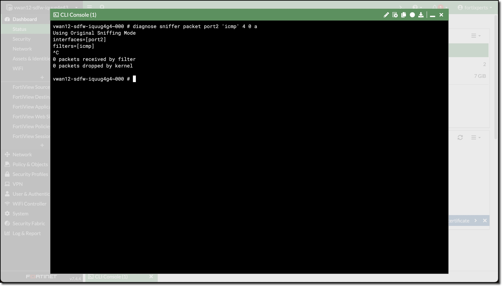
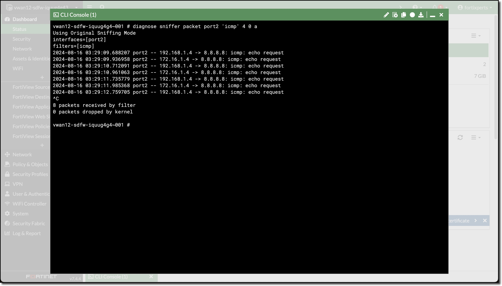
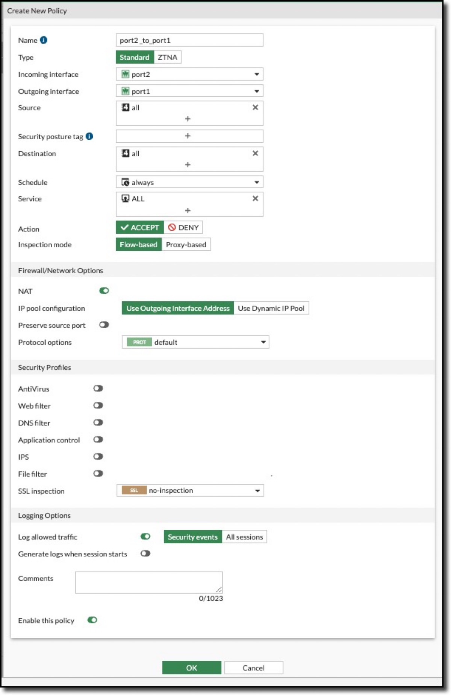
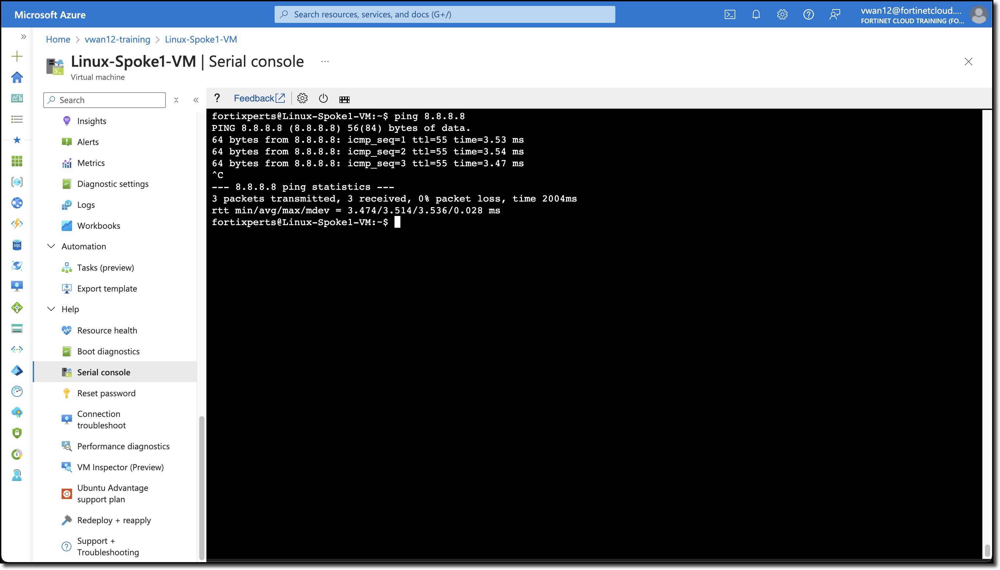
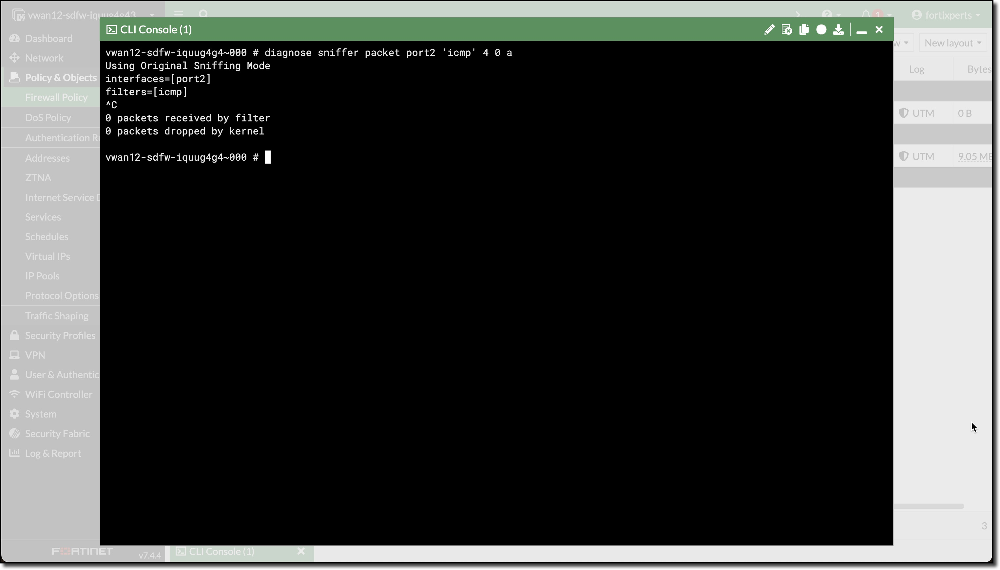
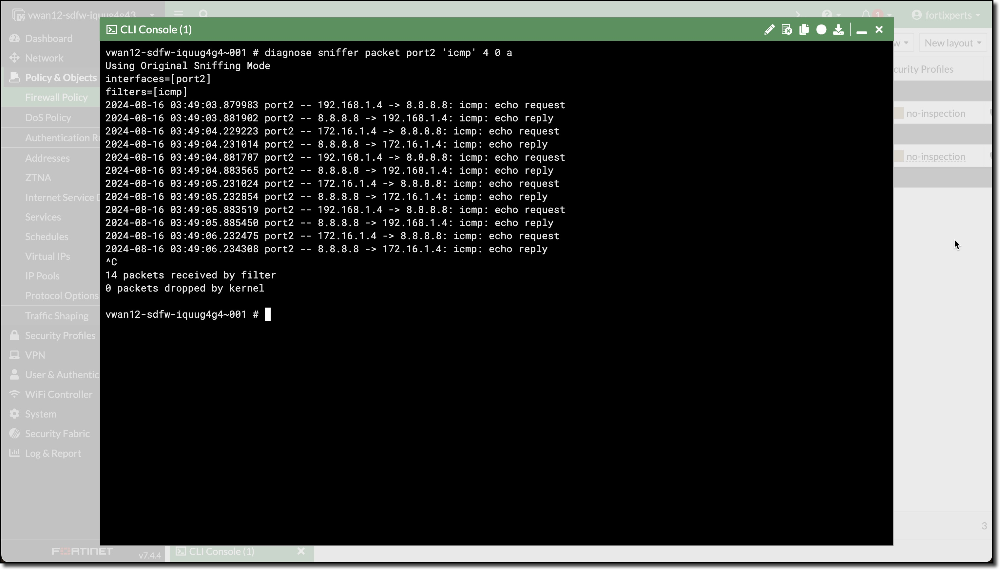

In this task, the student will create FortiGate firewall policies to allow North-South network traffic.

1. ***Ping*** from the Linux Spoke VMs to the Internet

    - ***Open*** a serial console connections to each Linux Spoke VM and ping the other Spoke VM
        - Linux-Spoke1-VM - `ping 8.8.8.8`
        - Linux-Spoke2-VM - `ping 8.8.8.8`

    Neither ping will be successful because the FortiGate is not allowing traffic from port2 to port1.

    However, the traffic from each VM **does reach the FortiGate**, but it is dropped. Firewall Policies are required to allow traffic to pass from port2 to port1, and then return back to the VM that originated the ping.

1. ***View*** ping traffic from Spoke VMs reaching the FortiGates

    - ***Open*** each FortiGate in a browser tab/window
    - ***Open*** FortiGate CLI
    - ***Run*** CLI command `diagnose sniffer packet port2 'icmp' 4 0 a`
      - **4** - means: print header of packets with interface name
      - **0** - means: continuous output
      - **a** - means: absolute UTC time, yyyy-mm-dd hh:mm:ss.ms

        Linux-Spoke1_VM | Linux-Spoke2_VM
        :-:|:-:
         | 

        In the screenshots notice how this time the ping traffic appeared on FortiGate 1

        FortiGate 0 | FortiGate 1
        :-:|:-:
         | 

    The ping traffic is only on one FortiGate, this is because the internal load balancer sends traffic from the Spokes to one of the FortiGates for inspection.

1. ***Create*** Firewall policies **on both** FortiGates to allow traffic to pass from port2 to port1 (Spoke to Internet)

    The FortiGates can be setup to sync configuration information. If one of the FortiGates was designated as the Primary configuration supplier and the other as a Secondary, any changes made to the Primary would be replicated to the secondary.

    Configuration Synchronization was not enabled on the FortiGates as part of this session.

    - ***Navigate*** to "Policy & Objects"
    - ***Click*** Firewall Policy
    - ***Click*** Create new

        Attribute | Value
        -|-
        Name | **port2_to_port1**
        Incoming interface | **port2**
        Outgoing interface | **port1**
        Source | **all**
        Destination | **all**
        Schedule | **always**
        Service | **ALL**
        NAT | **enabled**
        IP pool configuration | **Use Outgoing Interface Address**
        Enable this policy | **enabled**

    - ***Click*** "OK"

        

        Linux-Spoke1_VM | Linux-Spoke2_VM
        :-:|:-:
         | 

        FortiGate 0 | FortiGate 1
        :-:|:-:
         | 

Continue to ***Chapter 6 - Adding a Second vWAN Hub***
