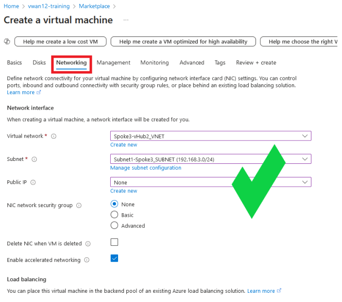
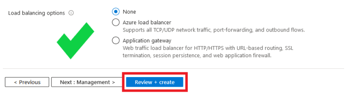
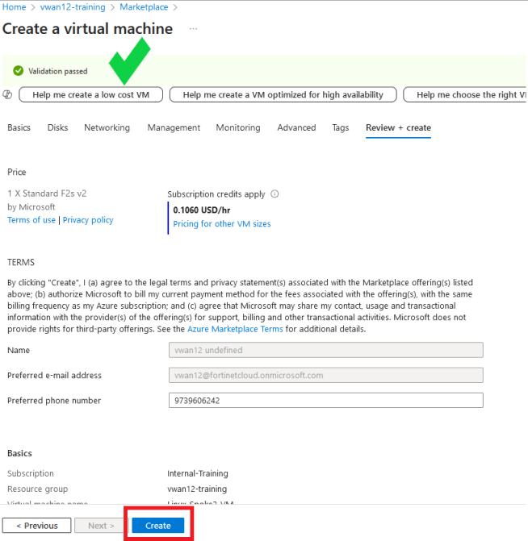
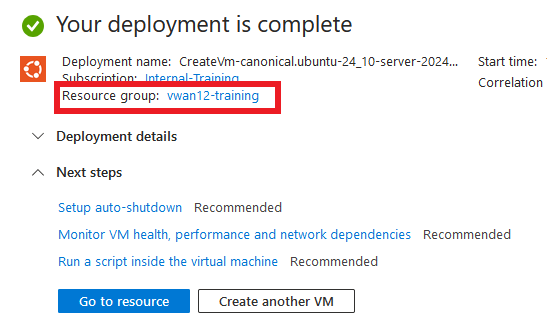

## Deploy a Linux VM

Now that you have the Spoke3-vHub2_VNET deployed, you are going to deploy a Linux VM in Spoke3-vHub2_VNET.  This VM will be used to test hub to hub connectivity between spokes peered to different hubs.

**Steps to create a Linux VM**
- 1. Navigate into your assigned Resource Group and click on the **+ Create** located at the top left of the tool bar.
  

You will be redirected to the Azure Marketplace.

- 2. In the Marketplace search bar, enter **ubuntu 24.10** and then enter.  Navigate to the **Ubuntu 24.10 - all plans** offering from **Canonical** and select **Create** and **Ubuntu Server 24.10**.

You will be redirected to the **Create a virtual machine** template.

- 3. Under the **Basics** tab, update the following fields:
(Leave the default entry of the other fields not listed here)
        - **Resource group**:  Confirm "**vwan12-training**"
        - **Virtual machine name**:  "**Linux-Spoke3-VM**"
        - **Region**: "**(US) West US**"
        - **Availability options**:  "**No infrastructure redundancy required**"
        - **Security type**:  "**Standard**"
        - **Authentication type**:  "**Password**"
        - **Username**:  "**fortixperts**"
        - **Password**:  "**Fortixperts2024!**"
        - **Confirm password**:  "**Fortixperts2024!**"

- 4. Confirm the changes and the other fields default entries match the following diagram.

- 5. Select **Next: Disks >**.

- 6. On the **Disk** tab, keep the default settings and click **Next: Networking >**.
Feel free to read through the available disk services that can be changed/enabled.

- 7. Under the **Networking** tab, update the following fields: (Leave the default entry of the other fields not listed here)
        - **Virtual network**:  "**Spoke3-vHub2_VNET**"
        - **Subnet**:  "**Subnet1-Spoke3_SUBNET (192.168.3.0/24)**"
        - **Public IP**:  Select **None**
        - **NIC network security group**:  Select **None**

- 8. Confirm the changes and the other fields default entries match the following diagram.

- 9. Select **Review + create >**.

- 10. Feel free to read through the **Management**, **Monitoring**, **Advanced**, and **Tags** tabs for additional services that can be changed/enabled.

- 11. Confirm the template validation has passed and select **Create**

- 12. The **Deployment is in progress** notice is displayed and then the **Your deployment is complete** notice is displayed, click on the **vwan12-training** link to be re-directed to your resource group.

- 13. Verify the new **Linux-Spoke3-VM** and the associated componets are listed in your Resource Group.

Continue to ***Chapter 6 - Task 4: VNET Peering to the Second Hub***
