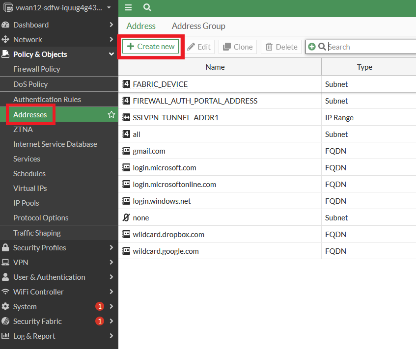
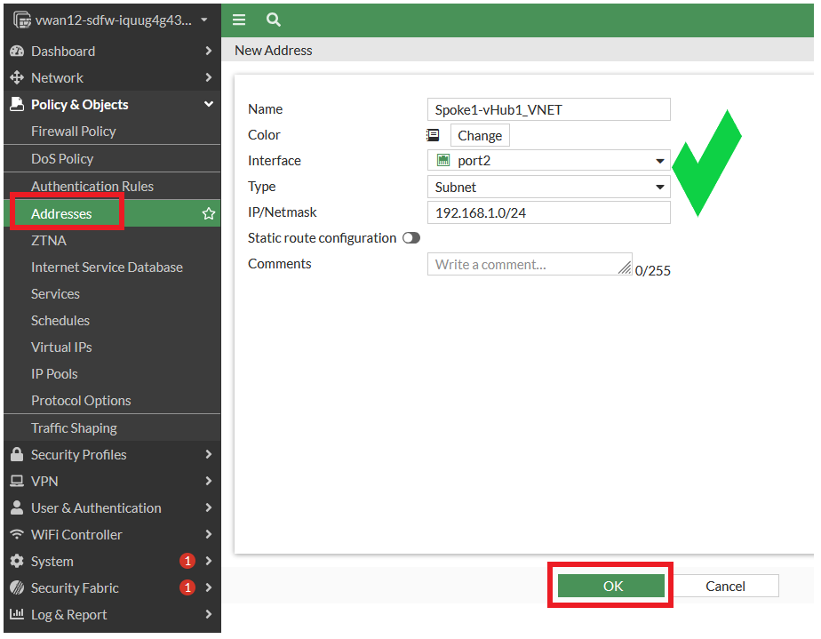
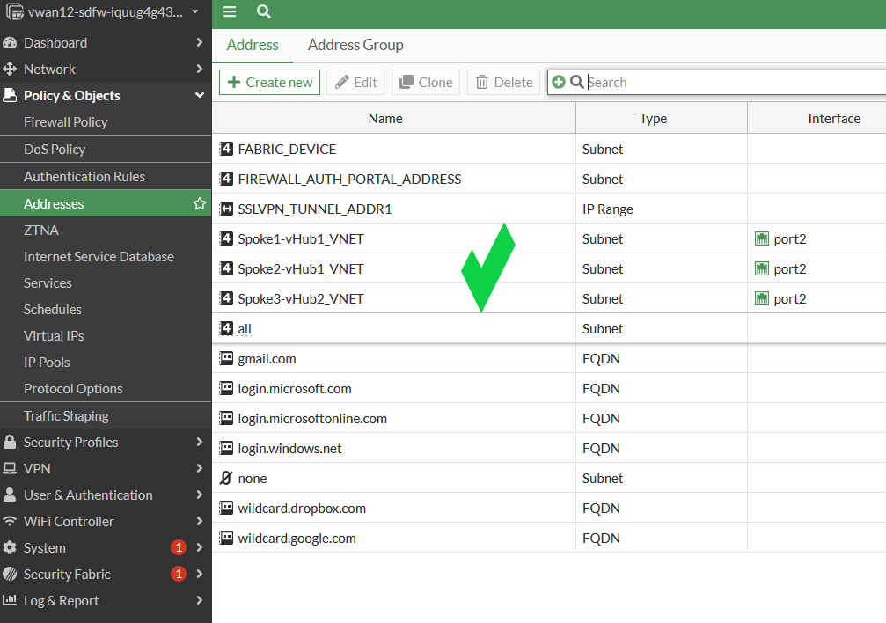
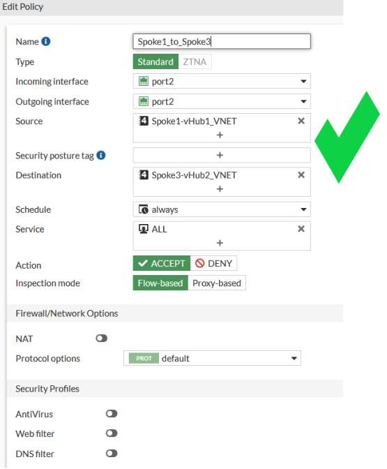
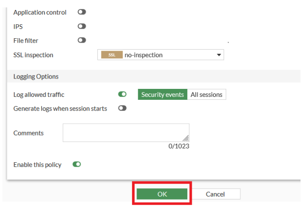

In this task, the student will create FortiGate firewall policies to allow or deny selective east-west network traffic between spokes in differant hubs.

Create the following addresses and firewall policies **on both** FortiGates.

1.  Create firewall addresses for Spoke1-vHub1_VNET, Spoke2-vHub1_VNET, and Spoke3-vHub2_VNET.
    - Login to both FortiGate NVAs
    - ***Navigate*** to "Policy & Objects"
    - ***Select***  "Addresses" and "+ Create new" at the top of the Address page.
    - ***Name***  Spoke1-vHub1_VNET
    - ***Interface***: port2
    - ***IP/Netmask***:  192.168.1.0/24
    - ***Click*** OK
    
    

Follow the above steps to create addresses for Spoke2-vHub1_VNET (192.168.2.0/24) and Spoke3-vHub2_VNET (192.168.3.0/24), both on interface port2.

2. Create a firewall policy to allow traffic to pass from spoke1 to spoke3.  Be sure to do this on both FortiGates.
***NOTE***:  Delete the existing port2_to_port2 policy!

    - ***Click*** Firewall Policy
    - ***Click*** Create new
        Attribute | Value
        -|-
        Name | **Spoke1_to_Spoke3**
        Incoming interface | **port2**
        Outgoing interface | **port2**
        Source | **Spoke1-vHub1_VNET**
        Destination | **Spoke3-vHub2_VNET**
        Schedule | **always**
        Service | **ALL**
        NAT | **disabled**
        Enable this policy | **enabled**
    - ***Click*** "OK"

        
        

Follow the above steps to create a firewall policy to deny traffic from spoke2 to spoke3 and another firewall policy to allow traffic from spoke3 to both spoke1 and spoke2.  Be sure to do this on both FortiGates.

3. Test connectivity between Linux spoke VMs.

    - ***Open*** a serial console connections on each Linux VM and ping the other spoke VM
        - Linux-Spoke1-VM - `ping 192.168.3.4`
        - Linux-Spoke2-VM - `ping 192.168.3.4`
        - Linux-Spoke3-VM - `ping 192.168.1.4`
        - Linux-Spoke3-VM - `ping 192.168.2.4`

    Did you get the results you expected?  If you did, great job!.  You are done with the course.
    If you did not, here are some helpful troubleshooing hints:
    - Did you enter the addresses and firewall policies on both FortiGates?
    - Double check your firewall policies.  Make sure NAT is disabled.
    - Make sure the adress names have the correct IP addresses.
    - Check your route table on the FortiGates.  Do you still see all three VNETs?

    If you checked all the above and you are still not getting the expected results, reach out to an instructor.

    ***Thanks for attending!***
