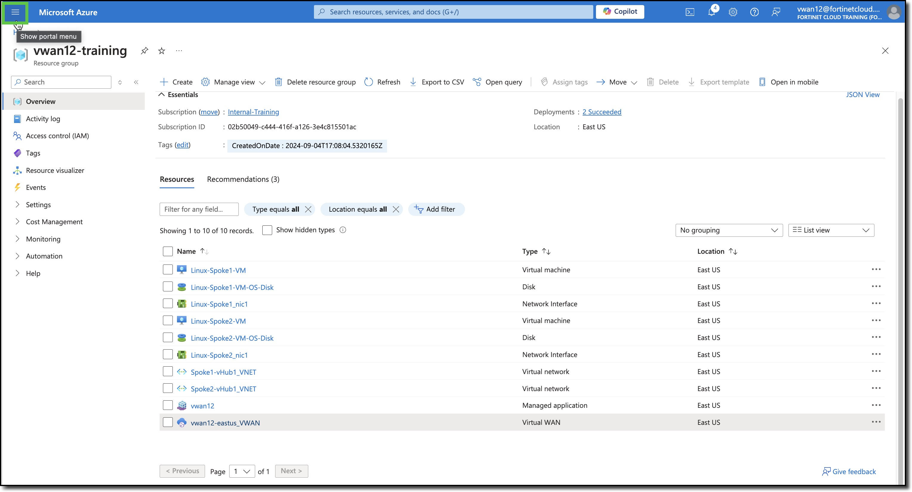
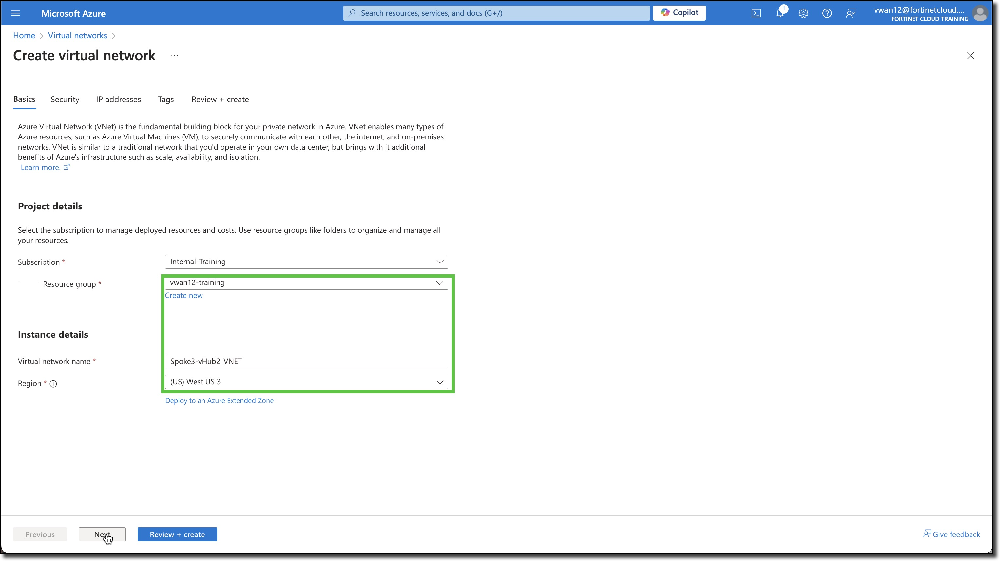
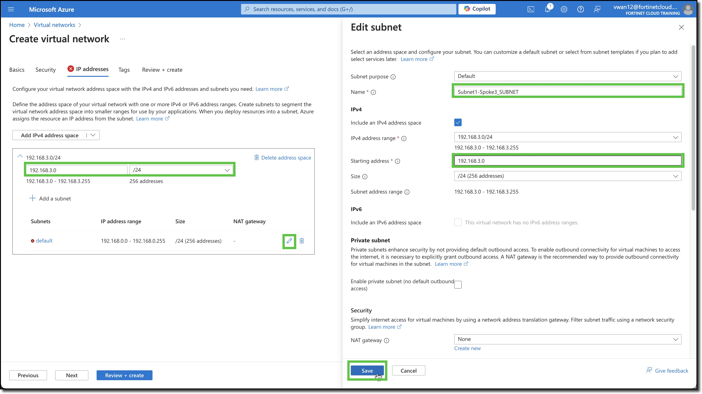
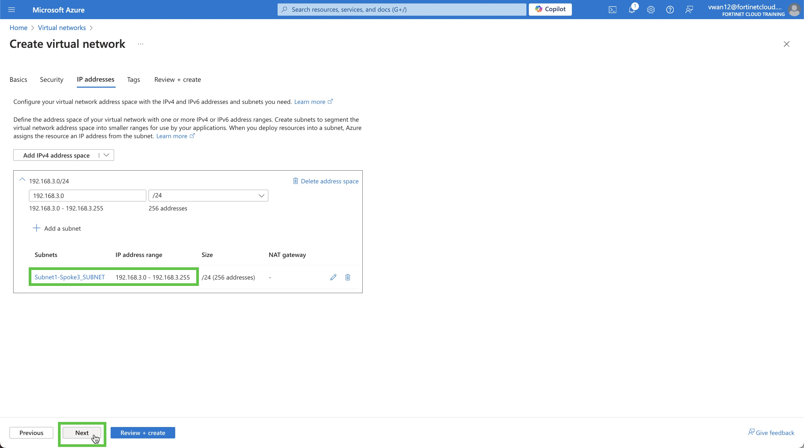
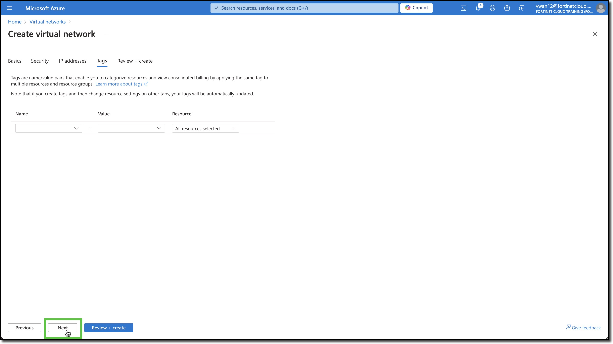
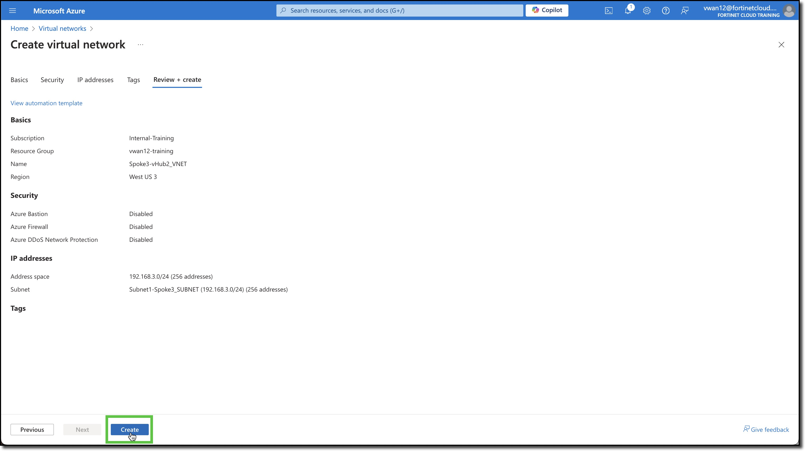
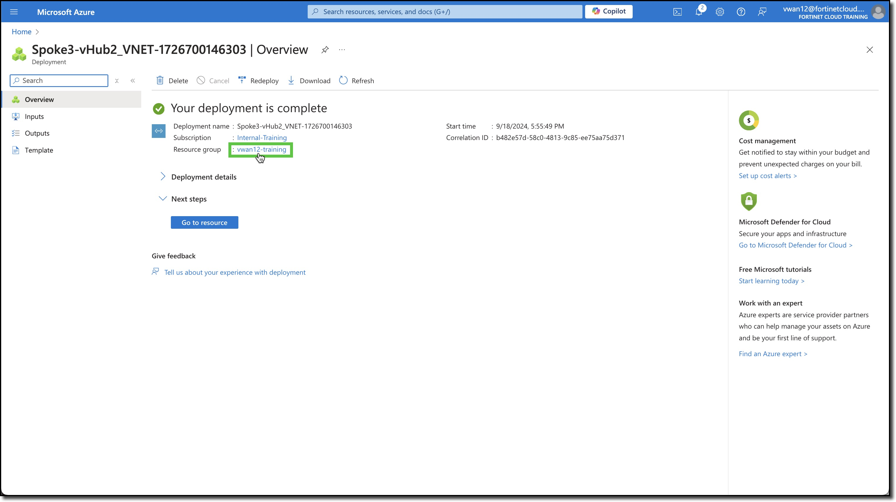

5: Manage Network Traffic Between Hubs

## Deploy a VNET

Azure Virtual Networks (VNET) can be peered to a vWAN hub. Once a VNET is peered to a vWAN hub, workloads in the VNET can communicate with workloads in other VNETs connected to other vWAN hubs that are part of the same vWAN.

1. ***Add*** a VNET

    - ***Navigate*** to your Resource Group **vwanXX-training**
    - ***Click*** - The Portal Menu button in the upper-left corner, sometime referred to as the hamburger button
    - ***Select*** - Virtual Networks in the left-hand navigation
    - ***Click*** - "+ Create" button

        
        
        

    - ***Select*** - your Resource Group **vwanXX-training**
    - ***Enter*** - Virtual network name **Spoke3-vHub2_VNET**
    - ***Select*** - Region "West US 3"
    - ***Click*** - "Next" button

        

    - ***Click*** - "Next" button on "Security" tab

       

    - ***Enter*** - Address Space **192.168.3.0**
    - ***Select*** - Netmask **/24**
    - ***Click*** - "Pencil" button to edit subnet configuration
    - ***Enter*** - Name **Subnet1-Spoke3_SUBNET**
    - ***Enter*** - Starting address **192.168.3.0**
    - ***Click*** - "Save" button

       

        - ***Click*** - "Next" button

       

        - ***Click*** - "Next" button

       

        - ***Click*** - "Create" button

       

        - ***Click*** - your resource group name when the deployment is complete

       

Continue to ***Next Task***
