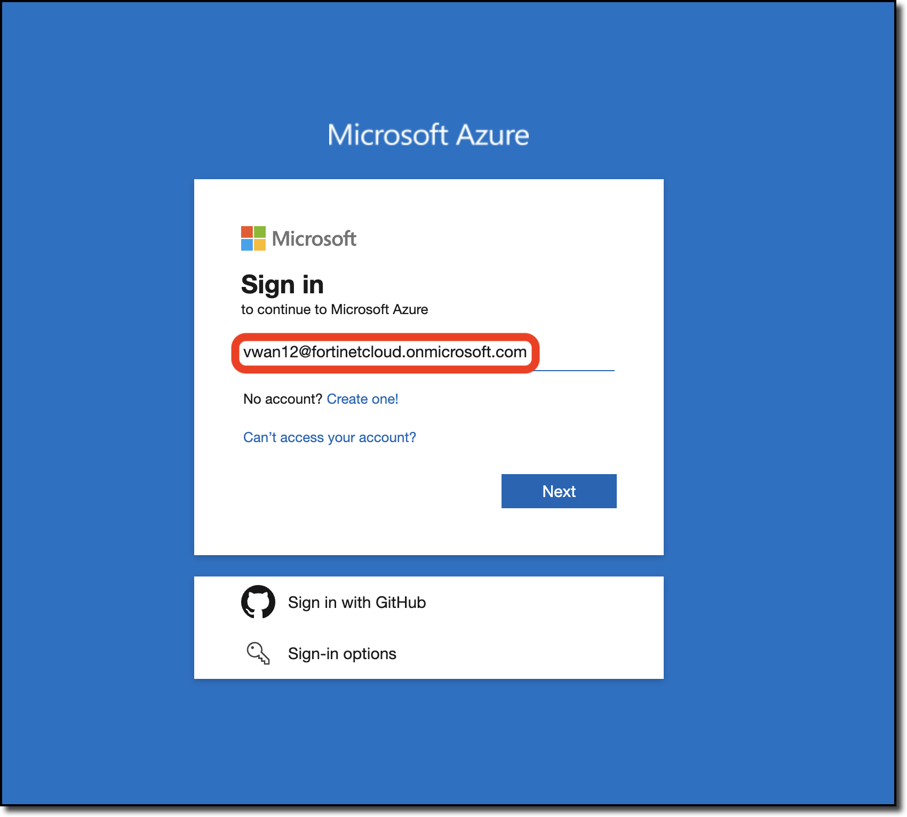
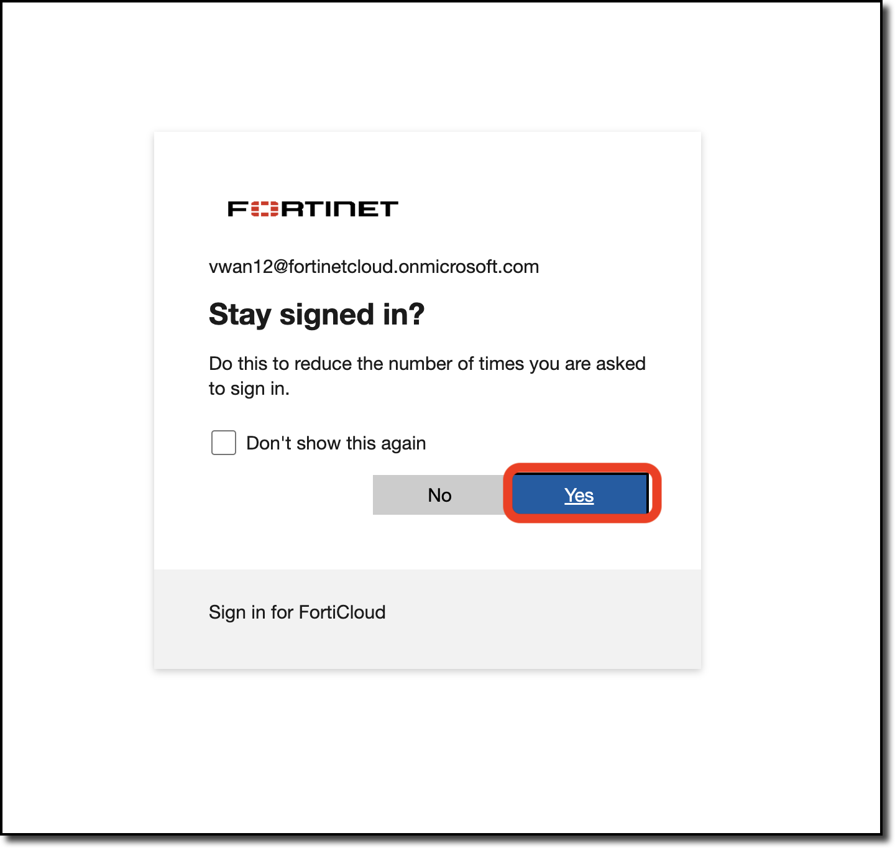
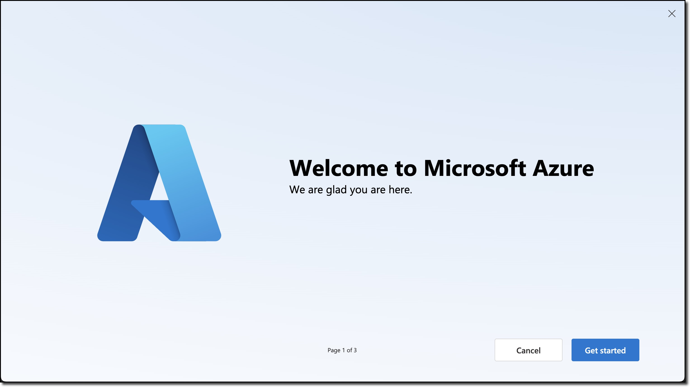
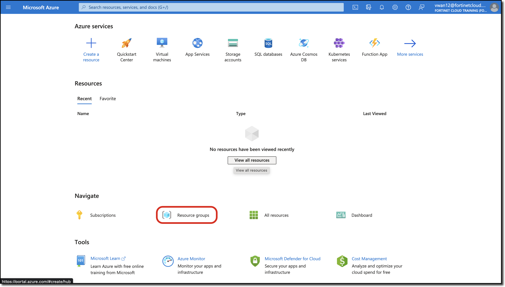
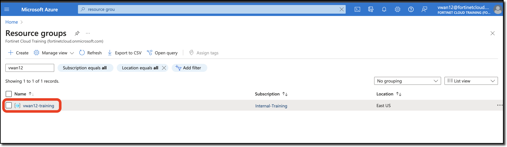

## Azure Portal & Resources

The work for this session takes place in Azure and on FortiGates deployed into the Azure Virtual WAN Hub. The first step is to logon to the Azure Portal.

### Login to Azure Portal and Review Existing Resources

1. ***Navigate*** to [Azure Portal](https://portal.azure.com)
1. ***Login*** with provided credentials

    

1. ***Click*** "Yes" to "Stay singed in?"

    

1. ***Click*** "Cancel" on the "Welcome to Microsoft Azure" page (if displayed)

    

1. ***Click*** "Resource groups"

    

1. ***Click*** your Resource Group named *vwanXX-training*. **XX** is the number of your allocated environment.

    

1. ***View*** the already deployed resources already deployed

    {}The assigned resource group has already been deployed with key resources of this session.{}

    - **Review** and make sure all the following resources are deployed in your resource group.
      - Virtual WAN (VWAN)
        - **vwanXX-eastus_VWAN**
        - Virtual Hub (VHUB)
          - **vwanXX-vHub1_eastus** - This resource is visible in the Virtual Wan page.

      - Virtual Networks (VNETS)
        - **Spoke1-vHub1_VNET**
        - **Spoke2-vHub1_VNET**

      - Virtual Machines (VMs) with disk and network interface
        - **Linux-Spoke1-VM**
        - **Linux-Spoke2-VM**

Continue to ***Next Task***
