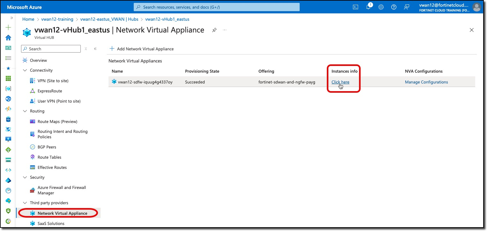
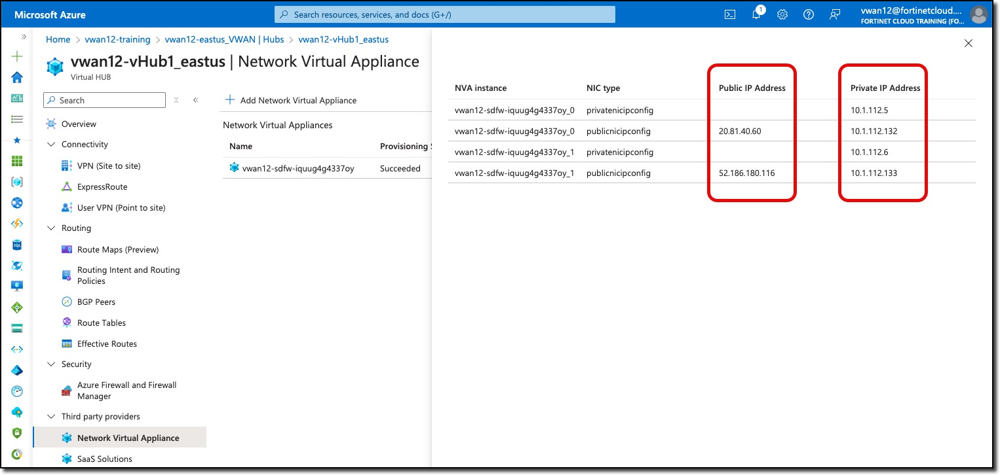

## Task 1

After FortiGate deployment is completed the next step is to configure **FortiGate Session Life Support** [FGSP](https://docs.fortinet.com/document/fortigate/7.4.4/administration-guide/869218/fgsp-basic-peer-setup) on both FortiGates to enable session sync to support the  Active-Active architecture.

### FGSP Setup

{}You will open a browser session to each FortiGate, the FortiGate GUI defaults to a 5 minute "Idle timeout". Avoid continually logging in by setting the idle timeout to 60 minutes in **System--> Settings:Administration Settings:Idle timeout**{}

1. ***Access*** FortiGate CLIs.

    - ***Navigate*** to your Hub **vwanXX-eastus_VWAN**
    - ***Click*** Network Virtual Appliance in the left-hand navigation
    - ***Click*** "Click here" link under "Instances info" in the right-hand "Network Virtual Appliances" pane
    - ***Note*** FortiGate Public IP and Private IP addresses
    - ***Open*** a browser tab to each FortiGate using the Public IP address of each FortiGate

    
    

1. ***Configure*** FGSP

    - ***Open*** a CLI session on each FortiGate

    {}Replace **x.x.x.x** with the port2 private IP address of the other FortiGate ending with **_1**. Copy these CLI commands to notepad or similar tool to update the *peerip* address.{}

- On FortiGate ending with **_0** configure the peerip address with the port2 private IP address of the FortiGate ending with **_1**.

    ``` bash
    config system standalone-cluster
        config cluster-peer
            edit 1
                set peerip x.x.x.x
            next
        end
        set standalone-group-id 1
        set group-member-id 1
    end

    config system ha
        set session-pickup enable
        set session-pickup-nat enable
        set session-pickup-connectionless enable
        set override disable
    end
    ```

1. ***Answer*** "**y**" to the "Do you want to continue? (y/n)" prompt

    **Changing standalone-group-id or group-member-id will potentially affect FGSP traffic.**</br>
    **Please first make sure the member is isolated from FGSP cluster properly.**</br>
    **Do you want to continue? (y/n)**</br>

    {}Notice that the **group-member-id** is **2** in the CLI commands below{}

- On FortiGate ending with **_1** configure the peerip address with the port2 private IP address of the FortiGate ending with **_1**.

    ``` bash
    config system standalone-cluster
        config cluster-peer
            edit 1
                set peerip x.x.x.x
            next
        end
        set standalone-group-id 1
        set group-member-id 2
    end

    config system ha
        set session-pickup enable
        set session-pickup-nat enable
        set session-pickup-connectionless enable
        set override disable
    end
    ```

1. ***Answer*** "**y**" to the "Do you want to continue? (y/n)" prompt

    **Changing standalone-group-id or group-member-id will potentially affect FGSP traffic.**</br>
    **Please first make sure the member is isolated from FGSP cluster properly.**</br>
    **Do you want to continue? (y/n)**</br>

FGSP is now configured and the FortiGates will share session information.

Continue to ***Task 2***
