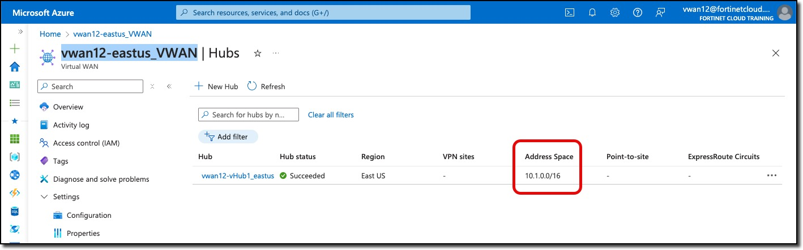
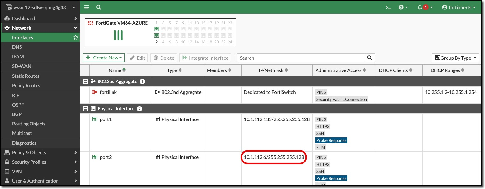
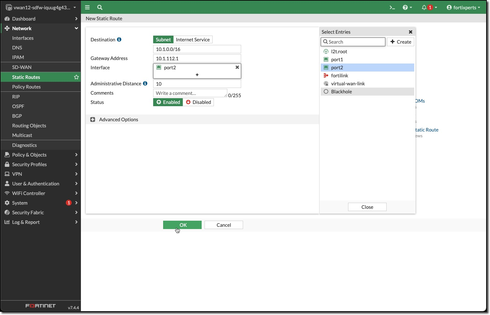
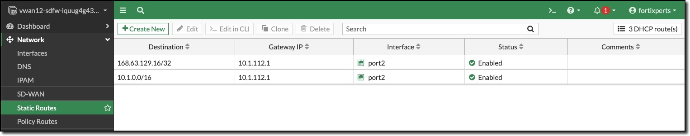
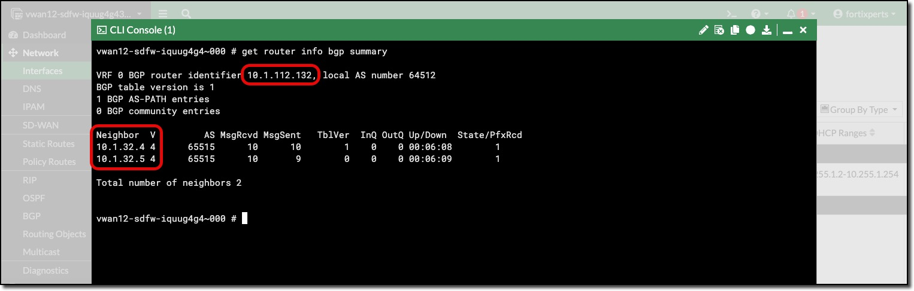
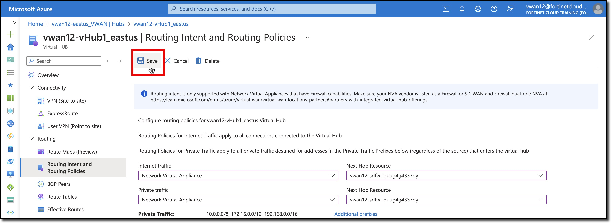

## BGP & Routing Intent

FortiGates in the VWAN Hub use BGP for routing, configure BGP on the FortiGates

### BGP Setup

1. ***Confirm*** Private address space of the vWAN hub

    The private address space of the vWAN hub is needed to create a summary route from the private address range to the secondary interfaces of the FortiGate NVAs to establish BGP peering. The BGP peers are already configured and ready to go online after the route is enabled.

    - ***Navigate*** to your Hub **vwanXX-eastus_VWAN**
    - ***View*** Hub Address space

        

1. ***Determine*** FortiGate NVA port2 Gateway

    Static routes are needed on the FortiGates to enable BGP, a component required to setup the static route is the gateway address of the FortiGate's port2 interface.

    Every subnet in Azure uses the first address in the subnet as the gateway. For example, in the subnet 10.1.1.0/24 Azure uses 10.1.1.1 as the subnet gateway.

    - ***Open*** each FortiGate in a browser tab/window
    - ***Click*** on Network
    - ***Click*** on Interfaces
    - ***View*** the assigned address of port2 and determine the gateway

    In the following example, the first IP of the subnet is 10.1.112.1.

    In the screenshot below the port2 IP address is 10.1.112.5/255.255.255.128 or a /25 mask, which makes the network address 10.1.112.0 and the first IP, which Azure assigns as the gateway, is 10.1.112.1

    

1. ***Configure*** Static Routes on each FortiGate

    Two static routes are required on each FortiGate

    - A static route to the virtual hub routers through the gateway of port2
    - A Static route for the internal Azure load balancer probes

    - ***Click*** Network
    - ***Click*** Static Routes
    - ***Click*** Create New

        

    - ***Enter*** Destination - `10.1.0.0/16`
    - ***Enter*** Gateway Address - `10.1.112.1`
    - ***Select*** Interface - **port2**
    - ***Click*** "OK"

    Repeat the process to add a static route for the load balancer probe

    - ***Enter*** Destination - `168.63.129.16/32`
    - ***Enter*** Gateway Address - `10.1.112.1`
    - ***Select*** Interface - **port2**
    - ***Enter*** Administrative Distance - `5`
    - ***Click*** "OK"

1. ***Repeat*** the commands on the other FortiGate

    
    

1. ***Verify*** BGP communication between FortiGate NVAs

    After configuring the static routes on both FortiGates BGP peering is automatically enabled.

    - ***Verify*** BGP communication between FortiGate NVAs in the CLI.

    - **Open** FortiGate CLI
    - **Run** CLI command `get router info bgp summary`

        

    More information about FortiGate static routes and BGP can be found in [Fortinet documents](https://docs.fortinet.com/document/fortigate-public-cloud/7.4.0/azure-vwan-ngfw-deployment-guide/860717/configuring-static-routes-and-enabling-bgp-on-fortigate-nvas).

### Enable Routing Intent

Routing Intent and Routing Policies allow you to configure the Virtual WAN hub to forward Internet-bound and Private (Point-to-site VPN, Site-to-site VPN, ExpressRoute, Virtual Network and Network Virtual Appliance) Traffic to an Azure Firewall, Next-Generation Firewall Network Virtual Appliance (NGFW-NVA) or security software-as-a-service (SaaS) solution deployed in the virtual hub.

1. ***Enable*** Routing Intent

    - ***Navigate*** to your Hub - vwanXX-vHub1_eastus
    - ***Click*** "Routing Intent" and Routing Policies
    - ***Select*** for "Internet traffic" - Network Virtual Appliance
    - ***Select*** for "Private traffic" - Network Virtual Appliance
    - ***Select*** for **both** "Next Hop Resources" - your cluster name (the only selection in the dropdown)
    - ***Click*** "Save" to update Routing Intent

        

Continue to ***Next Task***
