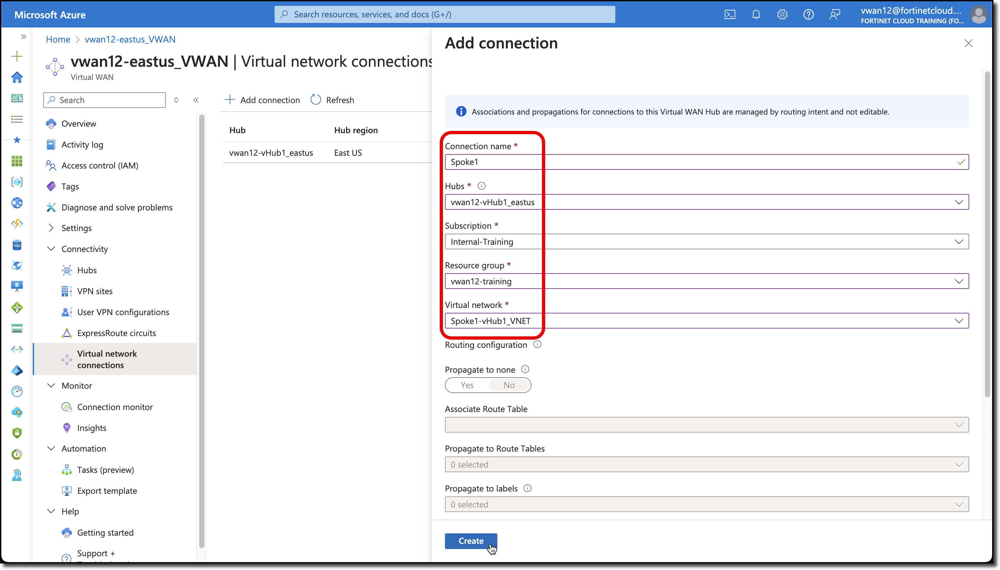
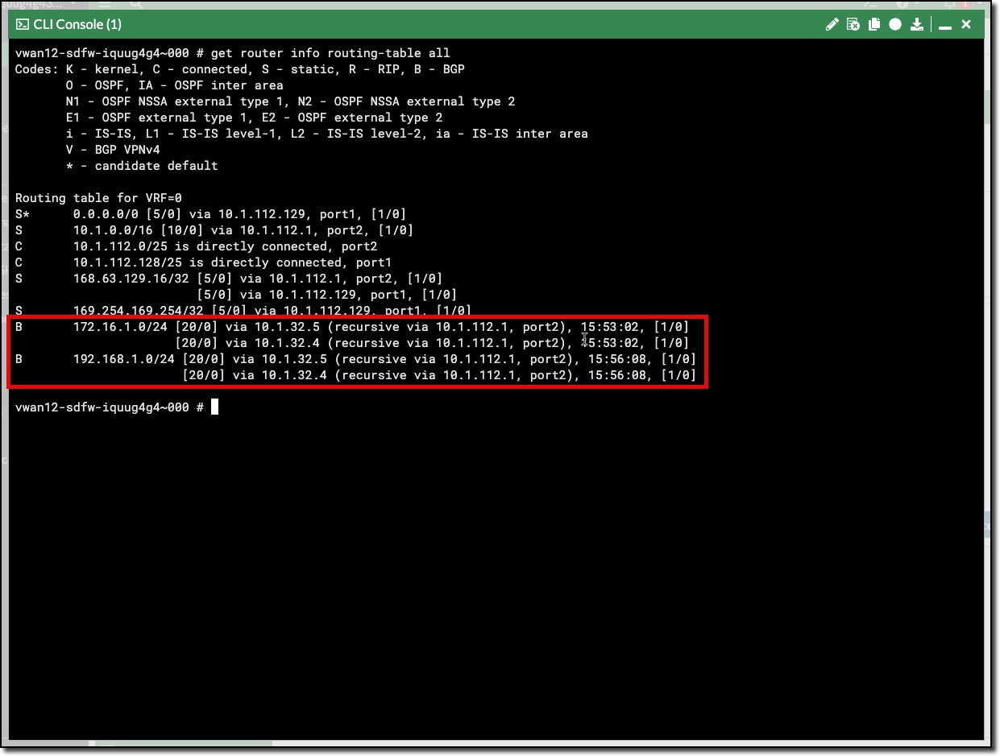
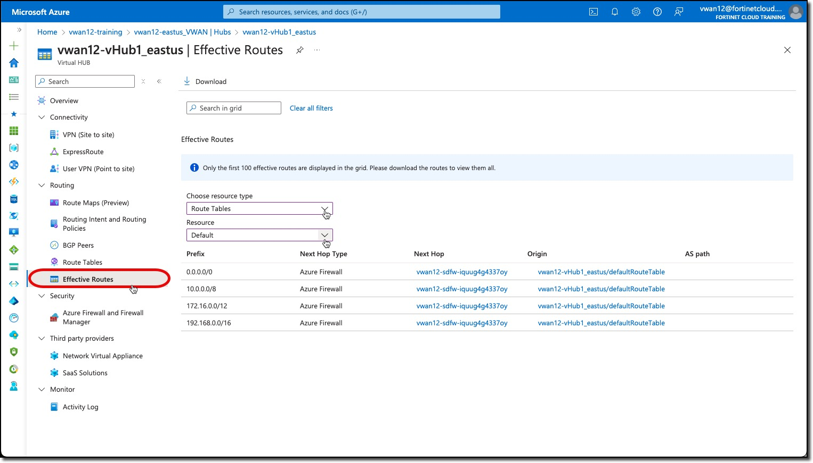
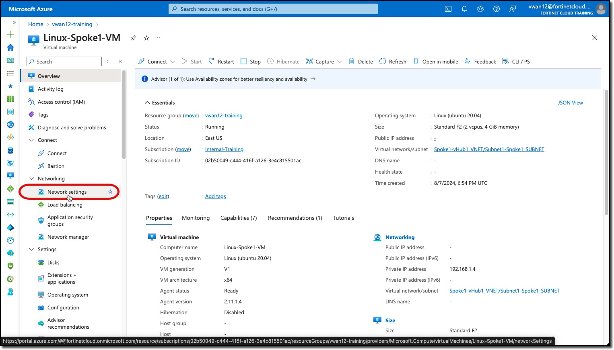
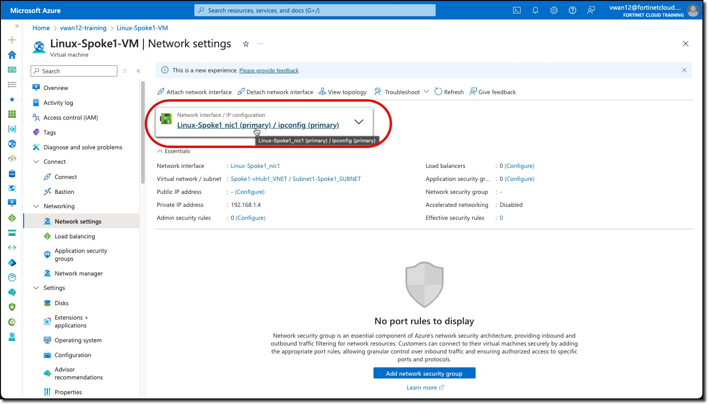
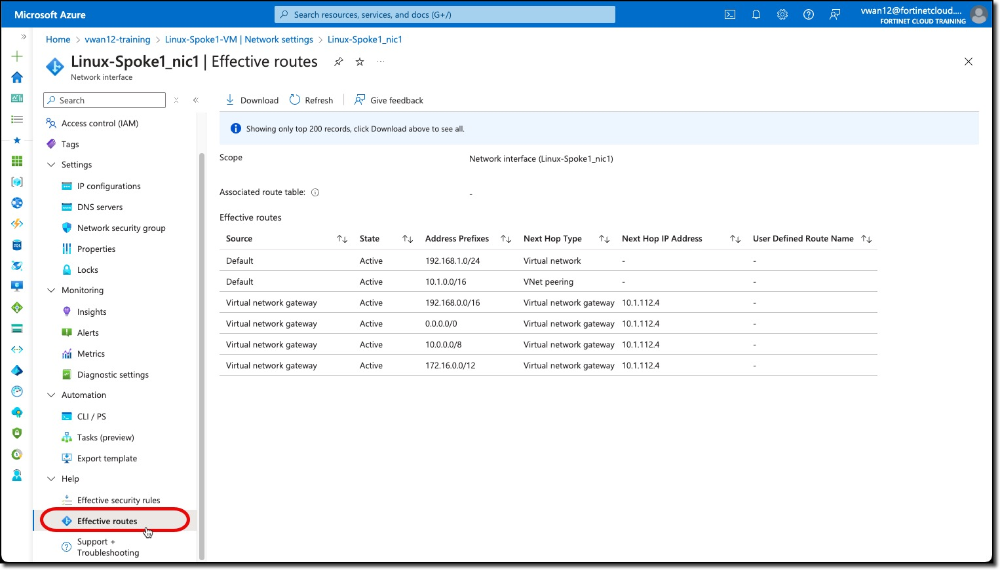

## VNETs & Verification

FortiGates are ready to inspect network traffic.

Network traffic will be coming from or going to workloads in the Spoke VNETs.

In order for the FortiGates to manage the traffic, the Spoke VNETs must be peered to the VWAN Hub.

### Peer Spoke VNETS to Hub

1. ***Peer*** Spoke1 VNET to hub

    - ***Navigate*** to your Virtual Wan - **vwanXX-eastus_VWAN**
    - ***Click*** "Virtual network connections"
    - ***Click*** "+ Add connection"

    - ***Enter*** - "Connection name" - `Spoke1`
    - ***Select*** - "Hubs" - your Hub -**vwanXX-vHub1_eastus**
    - ***Select*** - "Resource group" - your Resource - **vwanXX-training**
    - ***Select*** - "Virtual Network" - Spoke 1's VNET - **Spoke1-vHub1_VNET**
    - ***Click*** - "Create"

        

1. ***Peer*** Spoke2 VNET to hub

    - ***Navigate*** to your Virtual Wan - **vwanXX-eastus_VWAN**
    - ***Click*** "Virtual network connections"
    - ***Click*** "+ Add connection"

    - ***Enter*** - "Connection name" - `Spoke2`
    - ***Select*** - "Hubs" - your Hub -**vwanXX-vHub1_eastus**
    - ***Select*** - "Resource group" - your Resource - **vwanXX-training**
    - ***Select*** - "Virtual Network" - Spoke 2's VNET - **Spoke2-vHub1_VNET**
    - ***Click*** - "Create"

        {}VNET Peering takes a few minutes to complete. Status can be reviewed by ***Clicking*** Refresh{}

        

### Verification

Routes and routing are the key for users to access workloads in an Azure VNET and for those workloads to be able to access resources outside of their VNET. At this point routes and routing should be set within the Azure environment and in the FortiGate NVAs.

From the perspective of the FortiGate a decision will be made to send traffic to a specific port based on FortiGate Policy. Once the traffic leaves teh FortiGate's port it is up to Azure to forward the traffic.

Where traffic will be sent in Azure can be determined by viewing the effective Routes associated to a particular networking service.

- What routes do the FortiGates know about now?
- What are the effective routes of the Hub
- What are the effective routes of the Linux VMs in the Spoke VNETs?

1. ***View*** each FortiGate's Route Table

    - ***Open*** each FortiGate in a browser tab/window
    - ***Open*** FortiGate CLI
    - ***Run*** CLI command `get router info routing-table all`

        

    The output shows that BGP routes have been learned for the two Spoke VNETs that were peered to the Hub

1. ***View*** the Hub Effective Routes in the default Route Table.

    - ***Navigate*** to your Virtual Wan - **vwanXX-eastus_VWAN**
    - ***Click*** - "Network Settings"
    - ***Click*** - "Route Tables"
    - ***Click*** - "Effective Routes"
    - ***Select*** - "Choose resource type" "Route Tables"
    - ***Select*** - "Resource" "Default"

        All Effective Routes should have the FortiGate NVA group as next hop.

        

1. View the Effective Routes on Spoke Linux Virtual Machines

    - ***Navigate*** to your Linux Virtual Machine **Linux-Spoke1-VM**
    - ***Click*** - "Network settings"
    - ***Click*** - "Linux-Spoke1_nic1"
    - ***Click*** - "Effective Routes"

    - Repeat for **Linux-Spoke2-VM**

        
        
        

    **The effective route's next Hop IP is the IP address of Internal Load balancer is deployed with the FortiGate NVAs.**

Continue to ***Chapter 3***
