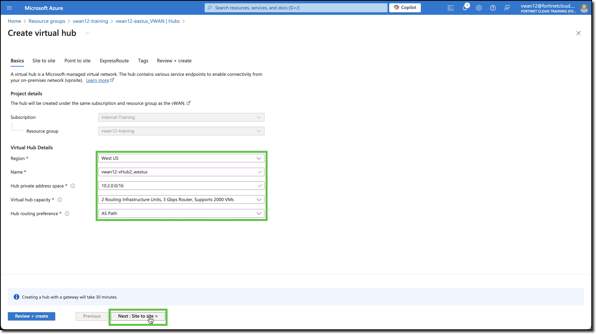
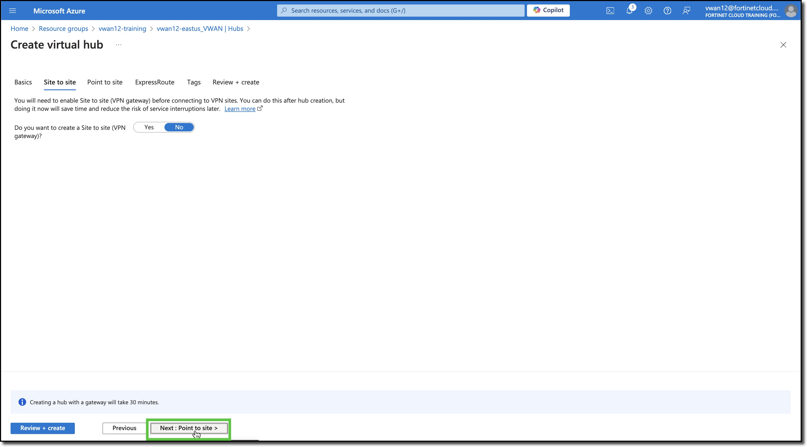
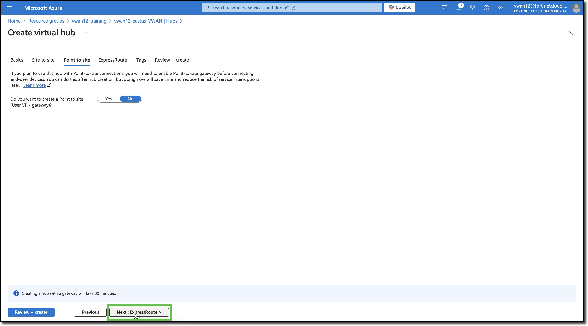
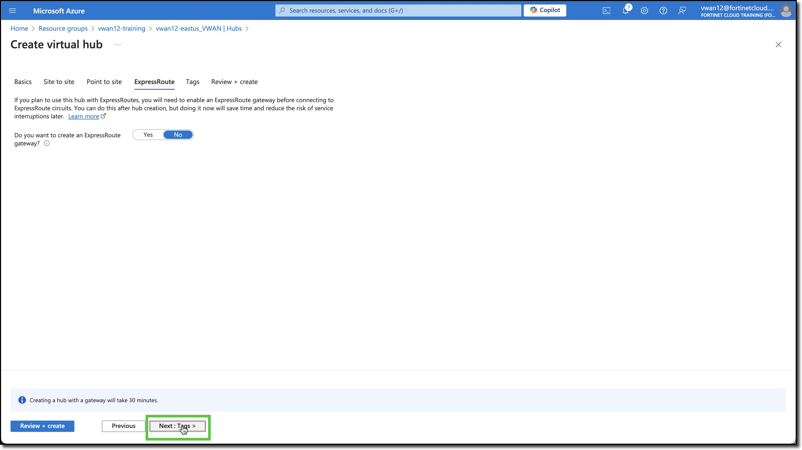
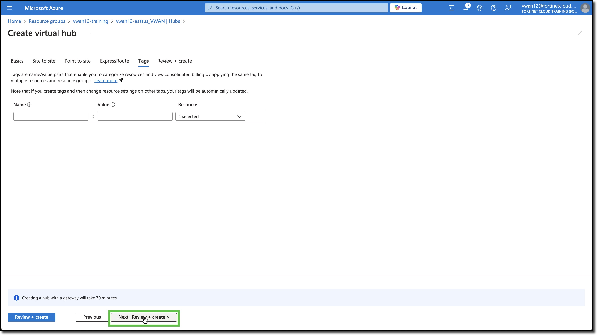
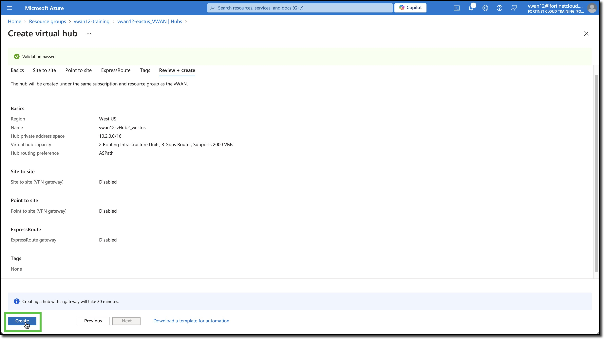
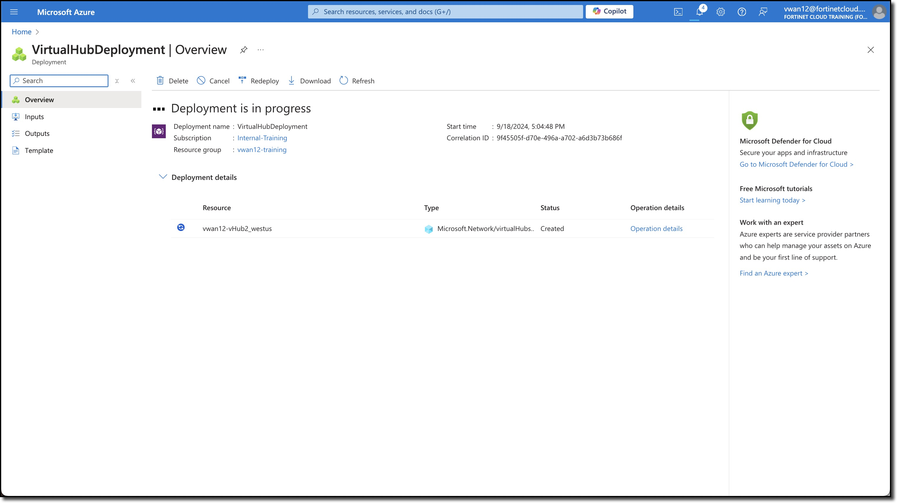
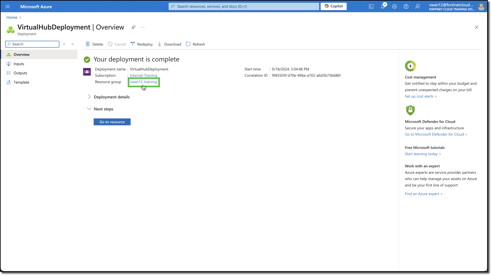

## Deploy a VWAN Hub

The initial Virtual WAN setup was already done for you before the session. Now you will deploy a Hub in another Azure Region. The Hub will eventually have a Virtual Network (VNET) associated to it, with a Linux server deployed in the associated VNET.

1. ***Add*** a VWAN Hub.

    - ***Navigate*** to your VWAN's **vwanXX-eastus_VWAN** hubs
    - ***Click*** - "+ New Hub" button

    - ***Select*** - Region "West US"
    - ***Enter*** - Name **vwanXX-vHub2_westus**
    - ***Enter*** - Hub private address space "10.2.0.0/16"
    - ***Select*** - Virtual hub capacity "2 Routing Infrastructure Units, 3 Gbps Router, Supports 2000 VMs"
    - ***Select*** - Hub routing preference "AS Path"
    - ***Click*** - "Next: Site to Site" button

        
        

    - ***Click*** - "Next: Point to Site" button
    - ***Click*** - "Next: ExpressRoute" button
    - ***Click*** - "Next: Tags" button
    - ***Click*** - "Next: Review + create" button
    - ***Click*** - "Next: Create" button

        
        
        
        
        

        {}A deployment progress screen will be shown followed by a deployment completion screen. Hub deployment can take up to 20 minutes. However you can open the Azure portal in another browser tab and continue with the next task.{}

        
        

Continue to ***Next Task***
