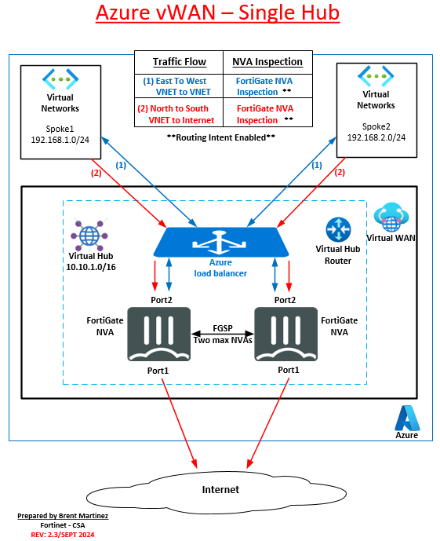

In this course you will learn how to deploy a FortiGate Network Virtual Appliance (NVA) into an existing Azure Virtual WAN (vWAN) to meet the requirements of Company ABC as they move server workloads from existing managed hubs and VNETs in Azure to the managed vWAN service. 
This course will start with understanding key services and terminology used in Azure when deploying vWAN, hubs, VNETs, and routing services. 
The course continues with the student deploying active/active FortiGate NVAs to secure the vWAN and configuring the the FortiGate NVAs to route and manage network traffic between Company ABC's hosted services.

### Course Goals

- Learn key Azure vWAN resources and terms related to this course
- Deploy a pair of FortiGate Network Virtual Appliances (NVAs) to an existing Azure Virtual WAN (vWAN) hub
- Enable Routing Intent to route the vWAN hub traffice to the Fortinet FortiGate NVAs
- Configure Static Routing and dynamic routing with BGP
- Connect existing Azure Virtual Networks (VNETs) to the vWAN Hub
- Manage East/West network traffic - Spoke-to-Spoke
- Manage North/South network traffic - Spoke-to-Internet
- Add a second vWAN hub, create and connect a VNET, and managed traffic between the vWAN hubs

**Continue to Chapter 1: Architecture Diagrams**
